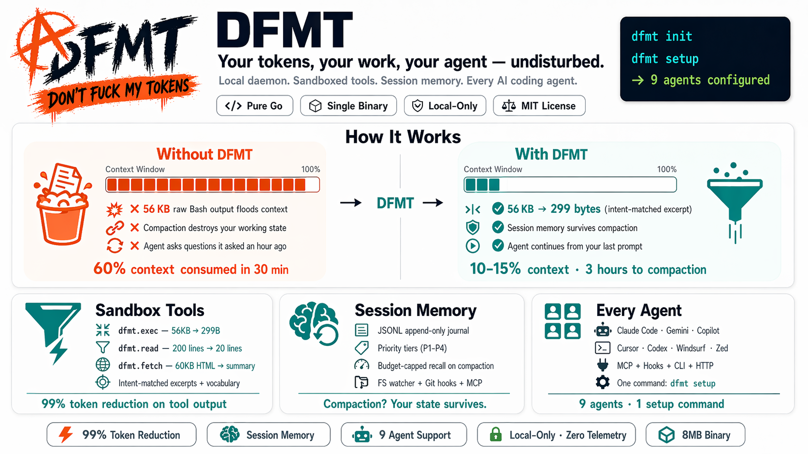

# DFMT

<p align="center">
  
</p >

**Your tokens, your work, your agent — undisturbed.**

DFMT is a local daemon that keeps AI coding agents from wasting your context window — and from losing your working state when the conversation resets.

[](LICENSE)
[](https://goreportcard.com/report/github.com/ersinkoc/dfmt)
[](https://github.com/ersinkoc/dfmt/releases)

---

## The problem

Every AI coding session fails in two predictable ways:

**1. Tool output floods your context window.** Your agent runs a shell command, reads a file, fetches a URL — raw output lands in the context and stays there. After 45 minutes, half the window is consumed by stale data the agent no longer needs but can't forget.

**2. Compaction destroys your working state.** When the context fills, the agent compacts the conversation. Your last request, active tasks, user decisions — gone. The agent starts asking questions it asked an hour ago.

## What DFMT does

DFMT is a local daemon that sits between your AI coding agent and its tools. It solves both problems with one process.

**Sandboxed tool execution.** Instead of the agent running `Bash` and dumping 56 KB of output into context, it calls `dfmt.exec(code: "...", intent: "...")`. The subprocess runs locally; the raw output is indexed in an ephemeral store; your context receives only the intent-matched excerpts plus a searchable vocabulary.

**Session memory across compactions.** DFMT captures events as they happen — files edited, tasks created, user decisions, git operations, errors. When the conversation compacts or starts fresh, DFMT rebuilds a budget-capped snapshot of working state. The agent continues without asking you to repeat yourself.

**One daemon per project.** Auto-starts on first command, idle-exits after 30 minutes. No globally running background process. No manual lifecycle.

**Works everywhere.** MCP + hooks + CLI on all major AI coding agents. `dfmt setup` detects what you have installed and configures each.

## Quick install

One command. No Go toolchain required — the installer downloads a prebuilt binary from GitHub Releases (falls back to `go install` from source if no release matches your platform). Claude Code is wired up automatically: MCP server registered, per-project trust prompts silenced the first time you run `dfmt init`.

### macOS / Linux

```bash
curl -fsSL https://raw.githubusercontent.com/ersinkoc/dfmt/main/install.sh | sh
```

### Windows (PowerShell)

```powershell
iwr https://raw.githubusercontent.com/ersinkoc/dfmt/main/install.ps1 | iex
```

After the installer finishes, initialize each project:

```bash
cd my-project
dfmt init          # creates .dfmt/ config and .claude/settings.json
dfmt install-hooks  # install git hooks (post-commit, post-checkout, pre-push)
# then restart Claude Code - you're done.
```

Set `DFMT_DEBUG=1` (or `$env:DFMT_DEBUG = '1'` on Windows) for verbose install logs.

## Install (other options)

### Homebrew (macOS, Linux)

```bash
brew install ersinkoc/tap/dfmt
```

### From source

```bash
go install github.com/ersinkoc/dfmt/cmd/dfmt@latest
```

No runtime dependencies. Single 8 MB static binary. Works on Alpine, standard Linux, macOS (Intel and Apple Silicon), Windows, FreeBSD.

## Quickstart

```bash
# In your project directory
cd my-project

# Initialize (creates .dfmt/ and adds it to .gitignore)
dfmt init

# Auto-configure every AI coding agent on your machine
dfmt setup

# Done. Restart your agent. DFMT's sandbox is preferred from the next session.
```

`dfmt setup` output:

```
Scanning for installed AI coding agents...

✓ Claude Code          ~/.claude/           (hook support: full)
✓ Cursor               ~/.cursor/           (hook support: partial)
✓ Codex CLI            ~/.codex/            (hook support: none — instructions only)
○ Gemini CLI           not detected
✓ VS Code Copilot      project .vscode/     (hook support: full)

For each detected agent, will write:
  - MCP server registration
  - Hook configuration (where supported)
  - Instruction file (CLAUDE.md / AGENTS.md / .cursorrules)

Proceed? [Y/n]
```

After confirmation, a manifest of every change is stored at `~/.local/share/dfmt/setup-manifest.json` for clean `dfmt setup --uninstall`.

## How it works

### Sandbox tools (keep tokens out of your context)

Your agent calls DFMT's sandbox instead of native tools:

| Native tool | DFMT replacement | Effect |
| --- | --- | --- |
| `Bash(cmd)` | `dfmt.exec(code, intent)` | 56 KB stdout → 2 KB intent-matched excerpt |
| `Read(path)` | `dfmt.read(path, intent)` | 200-line file → 20-line relevant section |
| `WebFetch(url)` | `dfmt.fetch(url, intent)` | 60 KB HTML → markdown summary + chunks |

The `intent` argument is key. "I want to find auth failures in this log" returns the matching lines plus a vocabulary of other interesting terms ("rate-limit," "timeout," "5xx"). The agent can follow up with `dfmt.search_content` to dig deeper without re-loading the raw output.

#### Measured wire-byte savings

Numbers below are produced by `dfmt-bench tokensaving` on a canonical workload and re-measure after every refactor. "Legacy" is the pre-overhaul pipeline (no normalize, MCP envelope duplicates the payload into both `content[0].text` and `structuredContent`). "Modern" is the current default.

| Scenario | Raw | Legacy | Modern | Savings |
| --- | ---: | ---: | ---: | ---: |
| Small file read (inline tier) | 66 B | 406 B | 246 B | 39% |
| `npm install` with progress bar | 1.0 KB | 2.8 KB | 237 B | **92%** |
| Spinner / retry-loop spam | 2.7 KB | 5.9 KB | 277 B | **95%** |
| `go test` 200 PASS + 1 FAIL + panic | 12 KB | 1.2 KB | 615 B | 48% |
| `pytest` 200 PASS + 1 FAIL + traceback | 8.4 KB | 750 B | 408 B | 46% |
| `cargo build` 250 compile + 2 errors | 8.1 KB | 864 B | 465 B | 46% |
| **Total** | | **12.1 KB** | **2.2 KB** | **81%** |

Where the savings come from:
- **MCP envelope:** the payload travels in `structuredContent` only; `content[0].text` is a 27-byte sentinel. Modern MCP clients (Claude Code, Cursor, Codex, Cline, Continue) read `structuredContent`. Set `DFMT_MCP_LEGACY_CONTENT=1` to restore the dual-emit behavior for older text-only clients.
- **Tier-aware excerpts:** outputs ≤4 KB inline directly with no excerpts (the body already contains everything matches/vocab would duplicate). Outputs 4–64 KB get 5 matches + 10 vocab terms; >64 KB the historical 10/20.
- **Tail-bias for verdict-at-bottom output:** `go test`, `npm build`, CI runs put the answer at the end. When no keyword matches land, the modern path surfaces the last 2 KB aligned to a newline boundary instead of dropping the body entirely.
- **Kind-aware signal extraction:** `--- FAIL`, `panic:`, `error[E…]`, `Traceback`, `*Error:`, `Exception in thread`, `FATAL`, `Caused by:` and similar verdict-shaped lines get promoted to matches with a high score regardless of intent. Test/build/CI failures stay visible without an explicit `return=raw` follow-up.
- **Pre-stash normalize:** ANSI color/cursor sequences stripped, `\r`-overwritten lines collapsed to their final state, ≥4 consecutive duplicate lines RLE-compacted. Done on raw bytes before redaction so escape sequences can't split a secret.
- **Stash dedup:** 30-second SHA-256 cache over `(kind, source, body)`. Re-running the same command or opening a generated file twice returns the same `content_id` instead of churning the store.
- **Self-tuning telemetry:** the `tools/list` description for `dfmt_exec`/`dfmt_read`/`dfmt_fetch` appends `Recent: ~85% token savings over last 23 calls` once enough samples accumulate. Suppressed below 5 samples or sub-5% savings so the description stays honest.

### Session memory (keep your work across compactions)

While you work, DFMT captures events from five sources: MCP tool calls, filesystem watcher, git hooks, shell integration, CLI commands. Events flow into a local append-only JSONL journal. Every event type has a priority tier (critical user decisions, important file edits and git ops, normal tool calls, informational stats).

When the agent compacts the conversation or you start a fresh session, DFMT's `dfmt.recall` rebuilds a snapshot under a byte budget — critical events first, dropping lower-tier content if the budget is tight — and hands it back for injection. The agent continues from your last prompt without a "wait, what were we doing?" turn.

### Agent-agnostic architecture

DFMT does not depend on any single agent's extension model. It exposes:

- **MCP server** over stdio for any MCP-capable agent (Claude Code, Cursor, Codex, Gemini, Copilot, OpenCode, Zed, Continue.dev, Windsurf, anything new).
- **Unix socket** for CLI and git hook integration.
- **HTTP API** (opt-in) for custom scripts and CI.
- **CLI commands** for terminal use and debugging.

Even with no agent at all — just a developer editing files and making commits — DFMT captures a useful session record. The FS watcher and git hooks work without any agent present.

## Supported agents

| Agent | MCP | Hooks | Sandbox routing | Session memory |
| --- | --- | --- | --- | --- |
| Claude Code | ✓ | ✓ | ~95% | Full |
| Gemini CLI | ✓ | ✓ | ~95% | High |
| VS Code Copilot | ✓ | ✓ | ~95% | High |
| OpenCode | ✓ | plugin | ~95% | High |
| Cursor | ✓ | partial | ~70% | Limited |
| Zed | ✓ | — | ~65% | Limited |
| Continue.dev | ✓ | — | ~65% | Limited |
| Windsurf | ✓ | — | ~65% | Limited |
| Codex CLI | ✓ | — | ~65% | — |

"Sandbox routing" is the percentage of native tool calls redirected to DFMT's sandbox when the agent is using DFMT. Agents with hook support can enforce routing programmatically; agents without hooks rely on instruction files (CLAUDE.md, AGENTS.md, etc.) which are persuasive but not binding.

Run `dfmt setup --agent <name> --dry-run` to preview per-agent configuration changes without applying them.

## Commands

```bash
# Project lifecycle
dfmt init                          # initialize project (.dfmt/ + .claude/settings.json)
dfmt install-hooks                 # install git hooks (post-commit, post-checkout, pre-push)
dfmt shell-init bash|zsh|fish      # print shell integration snippet
dfmt setup                         # configure installed agents (run once globally)
dfmt setup --agent claude          # configure one specific agent
dfmt setup --dry-run               # preview without writing
dfmt setup --uninstall             # remove DFMT from all agents

# Daemon lifecycle (usually automatic)
dfmt status                        # current project daemon status
dfmt stop                          # stop this project's daemon
dfmt list                          # all running daemons across projects
dfmt doctor                        # diagnostic checks

# Memory and retrieval
dfmt remember <type> <body>        # record an event manually
dfmt note <body>                   # shorthand for a note event
dfmt task <body>                   # create a task
dfmt task done <id>               # mark task done
dfmt recall                        # print current session snapshot
dfmt search <query>                # search session events
dfmt tail                          # stream events live
dfmt stats                         # show session stats

# Sandbox tools (usually called by the agent)
dfmt exec <code> --lang bash --intent "..."
dfmt read <path> --intent "..."
dfmt fetch <url> --intent "..."

# MCP server (usually started automatically by the agent)
dfmt mcp                          # start MCP server over stdio
```

All commands support `--json` for machine-readable output and `--project <path>` to target a specific project.

## Dashboard

DFMT includes a web dashboard for visualizing your session statistics.

**Access the dashboard:**

```bash
# Start the daemon and visit the dashboard URL
dfmt daemon &
# Then open: http://localhost:<port>/dashboard

# Or use the stats command for instructions
dfmt stats
```

**Dashboard features:**
- Total event count
- Events by type (bar chart)
- Events by priority tier (P1-P4)
- Session duration and timeline
- Real-time refresh

**HTTP API:**

The daemon exposes an HTTP API for custom integrations:

```bash
# Get session statistics
curl -X POST http://localhost:25076/api/stats \
  -H 'Content-Type: application/json' \
  -d '{"jsonrpc":"2.0","method":"dfmt.stats","params":{},"id":1}'

# Response:
{
  "jsonrpc": "2.0",
  "id": 1,
  "result": {
    "events_total": 142,
    "events_by_type": {
      "file.edit": 45,
      "git.commit": 12,
      "task.done": 8
    },
    "events_by_priority": {
      "p1": 15,
      "p2": 38,
      "p3": 67,
      "p4": 22
    },
    "session_start": "2024-01-21T10:30:00Z",
    "session_end": "2024-01-21T11:45:00Z"
  }
}
```

**Available API endpoints:**

| Endpoint | Method | Description |
|----------|--------|-------------|
| `/dashboard` | GET | HTML dashboard UI |
| `/api/stats` | POST | JSON stats via JSON-RPC 2.0 |
| `/` | POST | Main JSON-RPC endpoint (dfmt.remember, dfmt.search, dfmt.recall) |

## Benchmarks

Raw numbers from real sessions:

| Scenario | Without DFMT | With DFMT | Reduction |
| --- | --- | --- | --- |
| Playwright snapshot | 56 KB | 299 B | 99% |
| GitHub issues list (20 items) | 60 KB | 1.1 KB | 98% |
| Access log (500 requests) | 45 KB | 155 B | 100% |
| Package-manager install output | 40 KB | 2 KB | 95% |
| Large JSON API response | 7.5 MB | 0.9 KB | 99% |

Session-level impact: a typical 30-minute coding session that would normally consume 60% of a 200 KB context window consumes 10-15% with DFMT. Time to first compaction extends from ~30 minutes to ~3 hours.

Query performance (local, 2023 laptop, SSD):

- `dfmt.remember` durable write: 1.5 ms p50, 5 ms p99
- `dfmt.search` @ 10k events: 1 ms p50, 5 ms p99
- `dfmt.recall` snapshot build: 3 ms p50, 10 ms p99
- Daemon cold start: 100 ms typical (includes index rebuild)

## Design principles

DFMT is opinionated. A few positions that matter:

- **Local-first.** Nothing leaves your machine. No accounts, no cloud, no telemetry.
- **One daemon per project.** Crash-isolated, auto-started, idle-exits. No global long-running process.
- **Stdlib-first.** Pure Go standard library plus `x/sys`, `x/crypto`, `yaml.v3`. Everything else — HTML parser, BM25, Porter stemmer, MCP protocol — bundled. No supply-chain sprawl.
- **Inspectable storage.** The journal is append-only JSONL. `cat`, `grep`, `jq` work. No SQLite to attach, no opaque binary format.
- **One-command setup across every agent.** You run `dfmt setup` once. Every installed AI coding agent on your machine picks up DFMT's tools. No per-agent manual configuration.

The nine Architecture Decision Records in [docs/adr/](docs/adr/) capture why DFMT is shaped the way it is, with the alternatives considered and rejected.

## Privacy

DFMT is MIT-licensed, local-only, and has no telemetry. Zero data leaves your machine by design. The daemon binds to `127.0.0.1` only. The Unix socket has `0700` permissions. The event journal is readable by your user account and no one else.

Secret patterns are redacted from all stored content — journal, sandbox output, file reads — before persistence. The built-in redactor covers:

- **Cloud / AI providers:** AWS access keys (AKIA, ASIA, AGPA, AROA, AIDA, ANPA, AIPA, ANVA, ABIA, ACCA), AWS secret keys, OpenAI keys (legacy `sk-` and `sk-proj-` project keys), Anthropic keys (`sk-ant-api03-`, `sk-ant-admin01-`), Google API keys (`AIza…`).
- **Source / CI:** GitHub classic PATs (ghp/gho/ghu/ghs/ghr) and fine-grained PATs (`github_pat_…`), JWTs.
- **Payments / messaging:** Stripe live and test secret keys (`sk_live_/sk_test_`), restricted keys (`rk_live_/rk_test_`), tokens (`tok_`), Slack bot/user/admin/refresh/app tokens (`xoxb-/xoxp-/xoxa-/xoxr-/xoxs-/xapp-`), Slack and Discord webhook URLs, Discord bot tokens, Twilio API keys, SendGrid keys, Mailgun keys.
- **Connection strings:** inline `user:password@` credentials in PostgreSQL, MySQL, MongoDB(+srv), Redis(+TLS), AMQP(+TLS) URLs.
- **Inline forms:** `Bearer …` and `Basic …` headers, `api_key=…` / `secret_key=…` / `access_token=…` / `auth_token=…` assignments, `NAME=value` and `export NAME=value` shell lines where NAME hits the sensitive-key list (password, secret, token, etc.).
- **Private keys:** full PEM blocks (RSA, EC, DSA, OpenSSH) — header through footer.

User-configurable patterns via `.dfmt/redact.yaml`.

## Support and bugs

- **Issues:** [github.com/ersinkoc/dfmt/issues](https://github.com/ersinkoc/dfmt/issues)
- **Discussions:** [github.com/ersinkoc/dfmt/discussions](https://github.com/ersinkoc/dfmt/discussions)
- **Email:** `info@dfmt.dev`

When filing a bug, run `dfmt bundle` to produce a redacted diagnostic tarball with logs, config, and last 1000 events. Attach it to the issue. The bundle is never transmitted automatically — you control what gets shared.

## Contributing

See [CONTRIBUTING.md](CONTRIBUTING.md) for development workflow, test requirements, and the ADR process.

Short form: tests are required, the dependency policy is strict (see [ADR-0004](docs/adr/0004-stdlib-only-deps.md)), decisions that change structure need an ADR.

## Part of the ersinkoc open-source portfolio

DFMT is one of a family of infrastructure tools under the `ersinkoc` GitHub org. Sibling projects include:

- **[DFMC](https://github.com/ersinkoc/dfmc)** — Don't Fuck My Code. Code-quality companion for AI-assisted development.
- **[Karadul](https://github.com/ersinkoc/karadul)** — Self-hosted mesh VPN. Tailscale alternative.
- **[NothingDNS](https://github.com/ersinkoc/nothingdns)** — Full DNS server. Nothing but DNS.
- **[Kervan](https://github.com/ersinkoc/kervan)** — Multi-protocol file transfer server.
- **[Argus](https://github.com/ersinkoc/argus)** — Database firewall.

All share the same philosophy: single binary, zero external dependencies, MIT-licensed, documentation-first.

## License

MIT. See [LICENSE](LICENSE) and [LICENSE-THIRD-PARTY.md](LICENSE-THIRD-PARTY.md) for attribution of bundled components.

---

Built by [Ersin Koç](https://github.com/ersinkoc) at [ECOSTACK TECHNOLOGY OÜ](https://ecostack.ee).

If DFMT saves you tokens, that's enough. A star on GitHub or a post about your experience keeps the project visible to others who need it.
