# DFMT Architecture

**DFMT** ("Don't Fuck My Tokens") is a local Go daemon that bridges
AI coding agents (Claude Code, Cursor, Codex, Gemini, VS Code,
Windsurf, Zed, Continue, OpenCode) with their execution environment.
It exposes a uniform set of MCP tools for `exec`, `read`, `fetch`,
`glob`, `grep`, `edit` and `write`, returning **intent-matched
excerpts** instead of raw output, and persists every operation in an
append-only journal so that a future agent session can recall the
context after compaction.

This document describes the system from a build-and-debug
perspective: components, data flow, threading model, on-disk layout,
and security posture. It is written for engineers and AI agents that
need a working mental model of the codebase. The canonical onboarding
doc is [`AGENTS.md`](../AGENTS.md); this file is the architectural
deep dive.

> **Editorial note.** Mermaid blocks render in GitHub, GitLab, VS
> Code's preview, and most modern Markdown viewers. ASCII-art
> fallbacks are kept where the diagram type is awkward to express in
> Mermaid (sequence with notes, signed binary layouts, etc.).

---

## Table of contents

1. [System context](#1-system-context)
2. [High-level architecture](#2-high-level-architecture)
3. [Process model](#3-process-model)
4. [Entry points](#4-entry-points)
5. [CLI dispatch](#5-cli-dispatch)
6. [Daemon lifecycle](#6-daemon-lifecycle)
7. [Transport layer](#7-transport-layer)
8. [Core domain](#8-core-domain)
9. [Sandbox](#9-sandbox)
10. [Capture pipeline](#10-capture-pipeline)
11. [Session memory and recall](#11-session-memory-and-recall)
12. [Agent setup](#12-agent-setup)
13. [Configuration](#13-configuration)
14. [On-disk layout](#14-on-disk-layout)
15. [Concurrency model](#15-concurrency-model)
16. [Security posture](#16-security-posture)
17. [Build, test, release](#17-build-test-release)
18. [Package map](#18-package-map)
19. [End-to-end walkthrough](#19-end-to-end-walkthrough)

---

## 1. System context

DFMT sits **between** an AI agent and the operating system. The agent
never speaks to the kernel directly — every shell-out, file read,
HTTP fetch, glob, grep, edit, and write goes through DFMT's MCP
server. That gives DFMT three jobs:

1. **Token thrift.** Filter raw tool output down to what the agent
   asked for (the `intent` parameter). Stash full output in an
   ephemeral content store for later retrieval.
2. **Audit trail.** Append every operation to a per-project journal
   so future sessions can recall what happened.
3. **Policy enforcement.** Apply allow/deny rules per operation and
   per glob — agents cannot read `.env`, write to `.git/`, or shell
   into `sudo`.

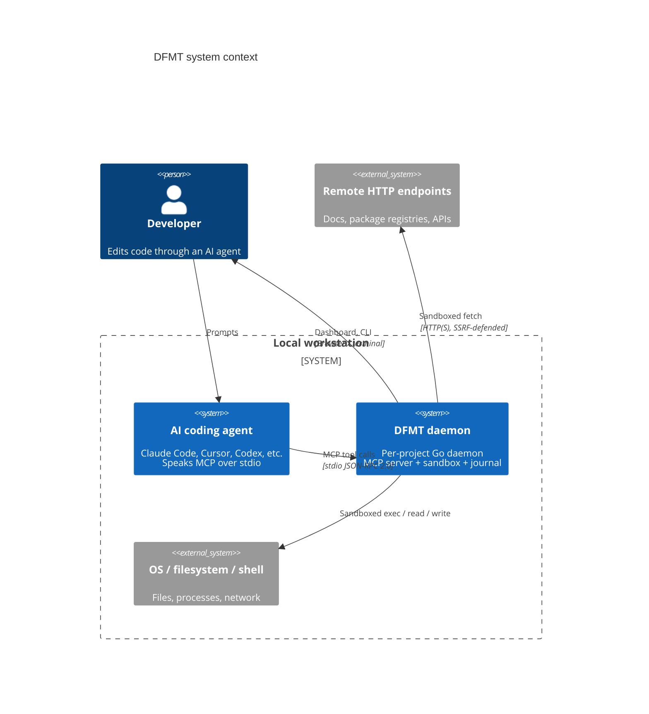

The "system context" claim is enforced socially, not by the kernel.
Agents that ignore `AGENTS.md` and call native `Bash`/`Read` tools
sidestep DFMT entirely. Token savings then collapse, but the journal
still records whatever does come through MCP.

---

## 2. High-level architecture

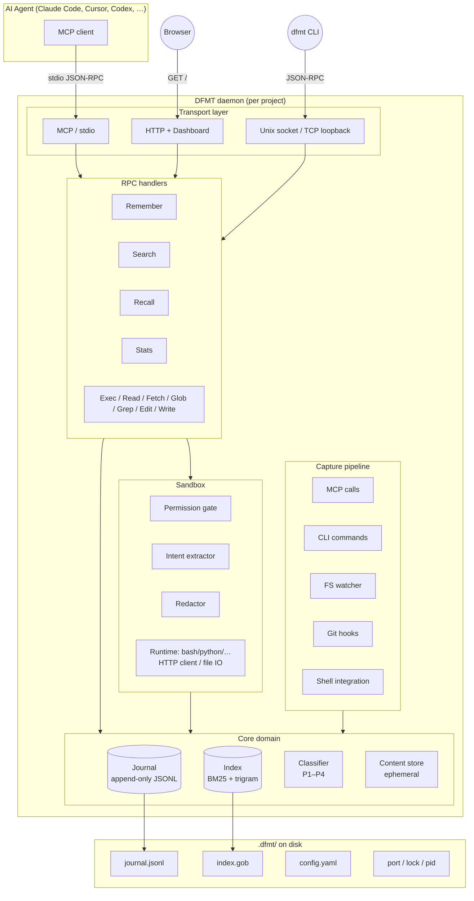

The shape is conventional: transports fan in, handlers fan out, the
core owns durable state, the sandbox owns side effects, and the
capture pipeline funnels external events into the same core.

---

## 3. Process model

DFMT runs as a **single daemon per project directory**. The first
CLI or MCP call in a project that finds no daemon listening will
spawn one (auto-start). The daemon idles out after a configurable
timeout (30 minutes by default) and exits cleanly.

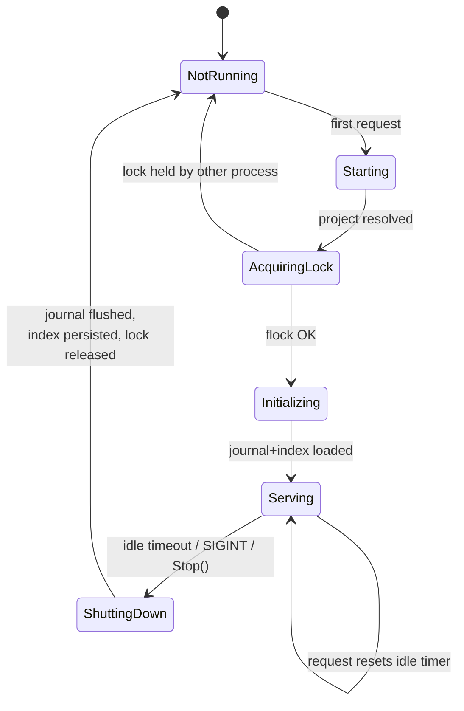

The lock lives at `<project>/.dfmt/lock` (mode 0o600). It is a
real `flock(2) LOCK_EX|LOCK_NB` on Unix
(`internal/daemon/flock_unix.go` via `golang.org/x/sys/unix`) and
a `LockFileEx` byte-range lock on Windows
(`internal/daemon/flock_windows.go` — lazy-loads `kernel32.dll`,
locks 1 byte at offset 0 with
`LOCKFILE_EXCLUSIVE_LOCK | LOCKFILE_FAIL_IMMEDIATELY`). Both paths
are **always non-blocking**, so a second `dfmt daemon` invocation
fails fast with `LockError` rather than queuing behind the
incumbent. The file mode 0o600 isn't what enforces exclusivity —
the kernel-level lock does — it's just so other local users on a
shared host don't learn that dfmt is running for the owning user
(F-G-LOW-1).

Auto-start is in `internal/client/client.go`:

1. The CLI client tries to dial the project's socket / port.
2. On failure it spawns `dfmt daemon` as a detached subprocess.
3. It then retries the dial with exponential backoff (50 ms → 1.2 s,
   total budget ≈ 3.9 s).
4. If the daemon never becomes ready it returns an explicit error.

### 3.1 Two journal writers: daemon vs `dfmt mcp`

The auto-start path above is the **CLI's** path — `dfmt exec`,
`dfmt read`, `dfmt search`, etc. dial the daemon's socket / TCP port
and call handlers via JSON-RPC. The daemon owns the durable journal
handle.

The **MCP** path (`dfmt mcp`, what an AI agent launches over stdio)
is structurally different: it does **not** dial the daemon and does
**not** auto-spawn one. Instead `runMCP` (`internal/cli/dispatch.go`)
opens its own per-process `core.OpenJournal` handle on
`.dfmt/journal.jsonl`, builds an in-process `transport.Handlers`, and
serves MCP JSON-RPC entirely without the daemon involved. This is why
an agent works on a project that has never been `dfmt daemon`-started:
the MCP child process is self-contained.

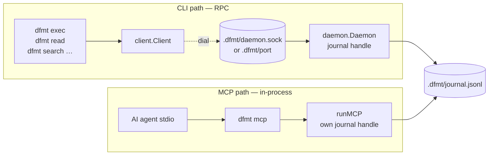

Concrete consequences:

- **Concurrent writers.** When the agent's `dfmt mcp` process is
  running and `dfmt daemon` is also running (e.g., the user uses
  the CLI in another terminal), both append to the same journal
  file. Each process serializes its own writes via `sync.Mutex`
  (`internal/core/journal.go`), and append-mode ordering across
  processes relies on POSIX `O_APPEND` atomicity for writes shorter
  than `PIPE_BUF`. There is no cross-process file lock on the
  journal.
- **Per-process indexes.** The MCP path persists its in-memory
  index back to `.dfmt/index.gob` on stdin EOF / SIGINT (via the
  `defer journal.Checkpoint + PersistIndex` block). The daemon
  persists on `Stop()`. A "last writer wins" race on `index.gob` is
  benign — both indexes derive from the same journal — but means
  the on-disk snapshot is never a strict superset of either side's
  view.
- **Hard-coded options on the MCP path.** Where the daemon reads
  journal options from `cfg.Storage.*`, `runMCP` hard-codes
  `MaxBytes: 10 MiB`, `Durable: true`, `BatchMS: 100`,
  `Compress: true`. (The `Compress` field is stored but not used —
  see §13.0.) Configuration drift between the two paths is a known
  asymmetry.

The daemon **does** still play roles the MCP path doesn't, even when
both are running: it owns the FS watcher (`capture.fs`), the HTTP
dashboard, the per-user process registry (`~/.dfmt/daemons.json`),
and the idle-shutdown timer.

---

## 4. Entry points

### 4.1 `cmd/dfmt/main.go` — primary CLI

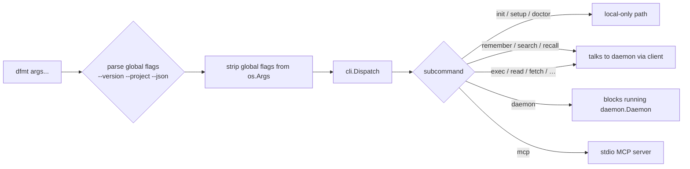

Global flags are pulled out before dispatch so subcommands never see
them. `--project` overrides project discovery; `--json` switches the
CLI to machine-readable output.

> **One version string, four readers** (consolidated in v0.2.0).
> The single source of truth is `internal/version.Current` (declared
> in `internal/version/version.go`). The build sets it via
>
> ```
> -ldflags "-X github.com/ersinkoc/dfmt/internal/version.Current=$VERSION"
> ```
>
> Four consumers read the same variable: (1) `cmd/dfmt/main.go`'s
> `--version` printer, (2) `internal/cli.Version` (a re-export
> preserved for older callers), (3) `internal/core.Version` (same),
> and (4) `internal/transport/mcp.go::handleInitialize`'s
> `serverInfo.version` field. Bumping the ldflag now updates every
> reader simultaneously. The pre-v0.2.0 layout shipped three
> independent strings that drifted between releases — the
> consolidation closed that drift. `cmd/dfmt/version.go` is now an
> empty placeholder; the legacy `-X main.version=…` form is gone.

### 4.2 `cmd/dfmt-bench/main.go` — benchmarking binary

A separate binary that exercises the same packages directly. Modes:
`tokenize`, `index`, `search`, `exec`, `tokensaving`, `all`.

The four micro-benchmarks each report ops/sec for a single hot
function on hardcoded inputs:

| Mode       | Function under test                              | Loop                                                                                          |
|------------|--------------------------------------------------|-----------------------------------------------------------------------------------------------|
| `tokenize` | `core.Tokenize`                                  | 10K iterations on a 200-byte text + 1K iterations on a 2 KB text (10x-repeated).              |
| `index`    | `core.Index.Add`                                 | Pre-load 100 `EvtFileEdit` events, then 1K `Add` calls of `EvtNote` events.                    |
| `search`   | `core.Index.SearchBM25`                          | Pre-load 50 events rotating through 8 query terms, then 500 calls to `SearchBM25("file edit commit", 10)`. |
| `exec`     | `sandbox.Sandbox.Exec` (bash runtime, real fork) | 50× `echo 'hello'` + 20× `ls -la /tmp`. Times the full sandbox+process round-trip, not just dispatch. |

`exec` is the only mode that touches the OS process boundary —
on Windows it requires `bash` on PATH (Git Bash, MSYS2, or WSL)
and `/tmp` to exist; missing prerequisites silently inflate the
per-op time rather than failing the run, since the bench does not
check exit status. `all` runs all four micro-benches and then
calls `runTokenSavingReport` via `defer` so users see both the
ops/sec table and the wire-byte savings report in one invocation.

`tokensaving` is **not** an end-to-end benchmark of real agent
sessions — it is a synthetic comparison of *legacy* vs *modern*
wire bytes for six canonical scenarios baked into
`tokensaving.go::buildScenarios`:

| # | Scenario                          | Body shape                                                      | Intent passed   |
|---|-----------------------------------|------------------------------------------------------------------|-----------------|
| 1 | small file read (inline tier)     | 7-line `package main` Go file                                     | `"main function"` |
| 2 | `npm install` with progress bar   | 21 CR-overwrite progress lines + final summary                    | `""` (empty)    |
| 3 | spinner retry-loop spam           | 50 identical "dialing host…" lines + "connected"                  | `""`            |
| 4 | `go test` 200 PASS + 1 FAIL + panic | 200 `=== RUN`/`--- PASS:` blocks + FAIL + panic + `FAIL` summary | `""`            |
| 5 | `pytest` 200 PASS + 1 FAIL + traceback | 200 `PASSED` lines + FAILED + traceback + AssertionError       | `""`            |
| 6 | `cargo build` 250 compile + 2 errors | 250 `Compiling some_crate` lines + 2 error[Exxxx] entries        | `""`            |

Two simulators wrap the same `ApplyReturnPolicy` to model the
before/after sizes:

- **`legacyWireBytes`** — calls `ApplyReturnPolicy` (no
  `NormalizeOutput`), then re-inflates the response with the legacy
  MCP envelope: full payload duplicated into `content[0].text`
  *and* `structuredContent`. The bench note explicitly admits this
  understates real legacy waste — the original "empty intent →
  inline full body" leak no longer has reproducible code, so the
  legacy figure models only the envelope duplication (a flat ≈ 50%
  tax independent of body size).
- **`modernWireBytes`** — runs `NormalizeOutput` first, then
  `ApplyReturnPolicy`, then writes the modern envelope: the
  27-byte sentinel `"dfmt: see structuredContent"` in
  `content[0].text` and payload only in `structuredContent`.

The output is a side-by-side byte count and percent-saved per row,
plus a total. The numbers are pure JSON byte counts the MCP
transport would write to the wire — they reflect the savings
pipeline (kind-aware signal extraction, intent-less default
filtering, MCP envelope dedup), not abstract agent-context savings.
Backs the README's "40–90 %" claim **for these scenarios**; real
sessions vary.

---

## 5. CLI dispatch

`internal/cli/dispatch.go` (≈ 3 300 lines) is the largest single
file. It is essentially a giant switch on the subcommand and a
collection of tiny `runX()` functions per command.

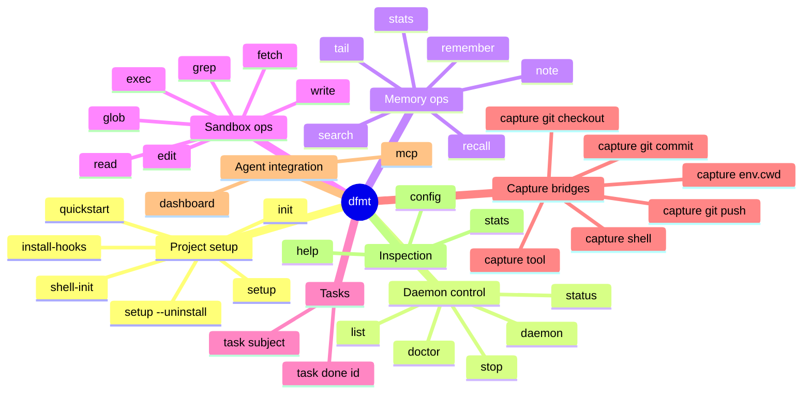

Each `runX()` function follows the same shape:

1. Resolve the project (`--project` → `DFMT_PROJECT` → walk up from
   `cwd` looking for `.dfmt/` or `.git/`).
2. Auto-init the project on first use.
3. Open a `client.Client` to the daemon (auto-spawn if needed).
4. Translate flags into RPC params, call the matching handler.
5. Render output as JSON or human prose depending on `--json`.

`buildCaptureParams()` (also in this file) is the bridge from the
git-hook / shell-integration `dfmt capture <kind>` invocations into
`transport.RememberParams`.

> **Subcommand maturity caveats.** Three subcommands shown above
> are partially implemented and worth knowing about before relying
> on them in operator scripts:
>
> - **`dfmt tail`** — `runTail` (`dispatch.go:1920`) prints
>   `"Streaming events..."` and returns; `--follow` prints
>   `"(tail --follow not yet implemented)"`. It does not actually
>   tail the journal yet. Use `dfmt search` or `dfmt recall` for
>   journal inspection in the meantime.
> - **`dfmt config`** — read-only display of three fields
>   (`capture.mcp.enabled`, `capture.fs.enabled`,
>   `storage.durability`). The trailing `args` parameter is reserved
>   for a future `get`/`set` UX; today the only way to change a
>   config value is to edit `.dfmt/config.yaml` directly. Use
>   `--json` to dump the full parsed config for inspection.
> - **`dfmt task done <id>`** — `runTask` (`dispatch.go:1630`)
>   simply prints `"Task <id> marked done"` and returns. It does
>   **not** journal a `task.done` event, does not look up the
>   referenced task, and does not validate the ID. The
>   `dfmt task <subject>` path is fully wired and creates a
>   `task.create` event via `runRemember` — only the `done`
>   sub-path is the stub.
>
> All other subcommands in the mind-map are fully wired.

`dfmt stats` from the CLI passes `NoCache: true` to bypass the
daemon's 5 s stats cache — humans interpret unchanged numbers as
"DFMT broke" and the cache TTL would otherwise hold the same value
across two consecutive shell invocations. Dashboard polling, which
hits the same `Stats` handler, leaves `NoCache=false` so the cache
absorbs its high-frequency refresh load.

---

## 6. Daemon lifecycle

`internal/daemon/daemon.go` owns the runtime. The struct holds the
journal, the index, the sandbox, the redactor, the FS watcher, the
transport server, and the goroutine coordination primitives.

### 6.1 Start sequence

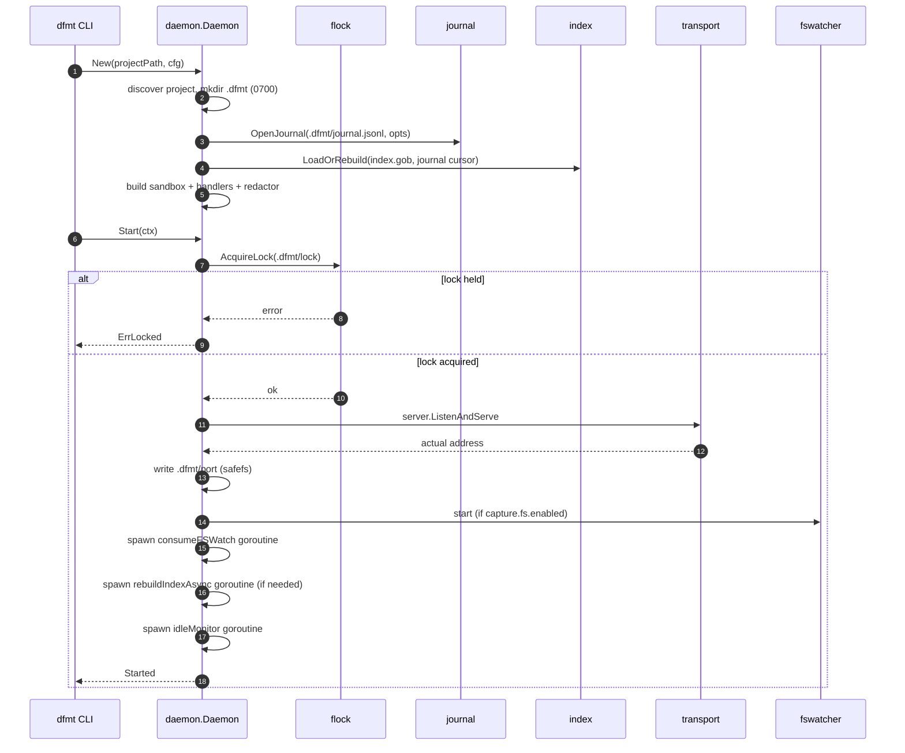

### 6.2 Goroutines

| Goroutine            | Lifetime        | Purpose                                                    |
|----------------------|-----------------|------------------------------------------------------------|
| `consumeFSWatch`     | until shutdown  | Drain `fswatcher.Events`, redact, append to journal+index  |
| `rebuildIndexAsync`  | one-shot        | Replay journal into index when `index.gob` is missing/stale |
| `idleMonitor`        | until shutdown  | Tick every `clamp(idleTimeout/10, 1s, 1m)`; call `Stop()` on idleness |
| `transport.Serve`    | until shutdown  | HTTP / socket / TCP accept loop                            |
| `journal sync ticker`| until shutdown  | Periodic `fsync()` in batched mode                         |

Activity is tracked through `lastActivityNs` (atomic int64). The
`transport.Handlers` package does not import `daemon` — instead the
daemon injects a `func()` callback at construction time via
`handlers.SetActivityFn(d.Touch)`, and every public RPC entry point
(`Remember`, `Search`, `Recall`, `Stats`, `Stream`, `Exec`, `Read`,
`Fetch`, `Glob`, `Grep`, `Edit`, `Write` — 12 handlers in total) calls
the unexported `h.touch()` shim as its first statement. `h.touch()`
takes the read lock, copies the callback pointer, releases, and invokes
it; the daemon's `Touch()` then stores `time.Now().UnixNano()` without
further contention. The idle monitor compares this timestamp to the
timeout on each tick — no `time.AfterFunc`, no timer goroutine leaks,
and no transport→daemon import cycle.

### 6.3 Stop sequence

The order in `Stop()` matters and is documented in the source. A
simplified view:

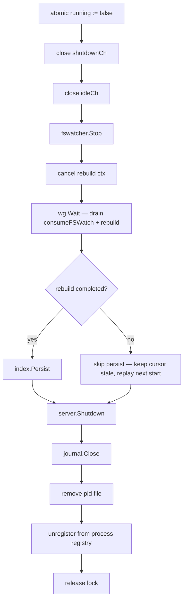

Skipping `index.Persist()` when rebuild is incomplete is deliberate.
Half-built indices on disk would silently miss documents on the next
start; replaying the journal on the next start is cheap and
correct.

### 6.4 Health checks (`dfmt doctor`)

`runDoctor` (`internal/cli/dispatch.go`) is the operator-facing
diagnostic. It pre-computes daemon liveness once, then runs nine
state checks plus two cross-cutting passes:

| # | Check                                          | Pass criterion                                                      |
|---|------------------------------------------------|---------------------------------------------------------------------|
| 1 | Project exists                                  | `project.Discover(dir)` returns a path                              |
| 2 | Config valid                                    | `config.Load(dir)` returns non-nil and validates                    |
| 3 | `.dfmt` directory                               | exists and is a directory                                           |
| 4 | Go toolchain (build)                            | `runtime.Version() ≥ go1.26.2`; older versions report a **warning** (not a failure) noting unpatched stdlib CVEs (GO-2026-4866 / 4870 / 4946 / 4947) — the binary still works, but a future TLS dashboard would inherit unpatched code |
| 5 | Journal openable                                | `journal.jsonl` opens cleanly (or is missing — also OK)             |
| 6 | Index file readable                             | `index.gob` opens cleanly (or is missing — also OK)                 |
| 7 | Port file consistent with daemon liveness       | port file exists ⇔ daemon alive — stale ports flagged               |
| 8 | PID file consistent with daemon liveness        | pid file exists ⇔ daemon alive — stale PIDs flagged                 |
| 9 | Lock file consistent with daemon liveness       | if file exists but daemon dead, attempt `flock` to detect orphans   |

After the table-driven checks, two additional passes run:

- **Per-agent wire-up** (`checkAgentWireUp`) — for every agent in
  the setup manifest, verifies each recorded MCP config file still
  exists and that the binary it points at is resolvable. Closes
  the silent-rot case where a user moved the dfmt binary or wiped
  the agent's config dir between sessions.
- **Instruction-block staleness** (`checkInstructionBlockStaleness`)
  — diffs the project's `CLAUDE.md`/`AGENTS.md` block body against
  the canonical version baked into this dfmt build. Surfaces a
  warning (not a failure) with the cure: `dfmt init` to refresh.

Exit code is `1` if any of the nine table checks or the per-agent
wire-up reported a hard failure; warnings (Go toolchain old,
instruction block stale) do **not** flip the exit code.

---

## 7. Transport layer

Three protocols, one set of handlers.

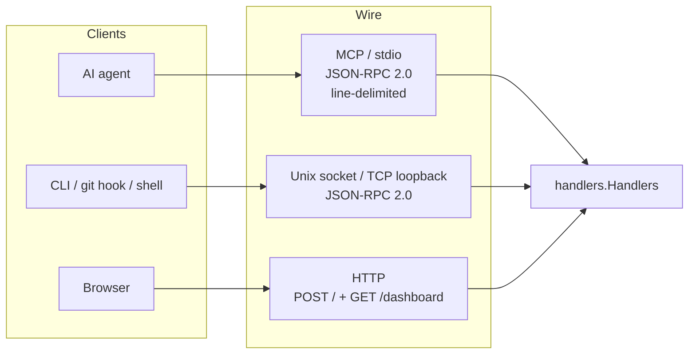

### 7.1 MCP (`internal/transport/mcp.go`)

Implements MCP 2024-11-05 enough to satisfy strict validators (Cursor,
Continue). Supports:

- `initialize` — capability handshake. The reply is built by
  `MCPProtocol.handleInitialize` (`internal/transport/mcp.go`) and
  consists of three fixed pieces:
  - `protocolVersion`: `"2024-11-05"` (from
    `config.DefaultMCPProtocolVersion`). DFMT does **not** echo the
    client's requested version — it always answers with its own
    pinned constant. Strict clients that demand version negotiation
    will see a mismatch; permissive clients (Claude Code, Cursor,
    Continue, Codex, Cline) accept it.
  - `capabilities`: `{"tools": {"listChanged": false}}`. The empty
    `tools` object would suffice per spec, but a *missing* `tools`
    field causes Claude Code to skip `tools/list` entirely and the
    server appears to expose nothing — hence the explicit struct.
    `listChanged: false` advertises that DFMT will not push
    `notifications/tools/list_changed`; tool descriptions are still
    self-tuning, but the agent re-reads them only on its own
    refresh cadence.
  - `serverInfo`: `{"name": "dfmt", "version": version.Current}`.
    `Name` is hardcoded `"dfmt"`; `Version` reads
    `internal/version.Current`, which is the same build-time
    string `dfmt --version` prints. Set the version via
    `-ldflags "-X github.com/ersinkoc/dfmt/internal/version.Current=v0.2.0"`
    at release time. Inspectors that scrape `serverInfo` for a
    release identifier and the `--version` output now agree on
    every cut (closes the v0.1 drift).
- **`notifications/initialized` (no response)** — JSON-RPC
  notifications are messages without an `id`. The dispatch loop
  short-circuits at `Handle()` with `if req.ID == nil { return nil,
  nil }`; callers must treat `(nil, nil)` as "no response on the
  wire". Replying to a notification is a protocol violation —
  Claude Code in particular treats a server that responds to
  `notifications/initialized` as broken and disconnects.
- `tools/list` — eleven tools (table below). Descriptions are
  **self-tuning**: observed compression ratios from past
  exec/read/fetch calls are appended so the agent gets up-to-date
  evidence that `intent` is paying off. Mechanics:
  - Per-type aggregation keyed on `tool.exec` / `tool.read` /
    `tool.fetch` etc. into `toolCompression{n, rawBytes,
    returnedBytes}` (`MCPProtocol.statsCache`).
  - **Cache TTL: 60 s** (`toolStatsTTL`) — `tools/list` polls and
    reconnects within a session reuse the cached aggregation
    instead of re-streaming the journal each time.
  - **Sample floor: 5** (`toolStatsMinSamples`) — below this the
    description suffix is **suppressed entirely**; advertising
    "savings: ~0% over 1 call" on a fresh project would be noise.
  - Stale cache is recomputed by streaming the journal and
    summing `data.raw_bytes` / `data.returned_bytes` over the
    `tool.*` events of each type.
- `tools/call` — dispatches into the handlers.
- `ping` — health check.

| Tool             | Handler   | Required params                | Notes                                                          |
|------------------|-----------|--------------------------------|----------------------------------------------------------------|
| `dfmt_exec`      | Exec      | `code`                         | `lang`, `intent`, `return`, `timeout`. Default lang = bash.    |
| `dfmt_read`      | Read      | `path`                         | `intent`, `offset`, `limit`, `return`.                         |
| `dfmt_fetch`     | Fetch     | `url`                          | SSRF-defended (see §9). `intent`, `method`, `return`, timeout. |
| `dfmt_glob`      | Glob      | `pattern`                      | `intent`.                                                      |
| `dfmt_grep`      | Grep      | `pattern`                      | `files`, `intent`, `case_insensitive`, `context`.              |
| `dfmt_edit`      | Edit      | `path`, `old_string`, `new_string` | Atomic via safefs.                                         |
| `dfmt_write`     | Write     | `path`, `content`              | Logs SHA-256 + size, **not** the content body.                 |
| `dfmt_remember`  | Remember  | `type`                         | LLM token tracking + tags + actor.                             |
| `dfmt_search`    | Search    | `query`                        | BM25 over journal.                                             |
| `dfmt_recall`    | Recall    | (none)                         | `budget` (bytes), `format` (md/json/xml).                      |
| `dfmt_stats`     | Stats     | (none)                         | TTL-cached aggregates.                                         |

The `dfmt remember` CLI subcommand mirrors the MCP tool but routes
through `client → daemon → handlers.Remember` and exposes the token
fields as top-level flags (`-input-tokens`, `-output-tokens`,
`-cached-tokens`, `-model`) instead of a `data` object — the dispatcher
in `internal/cli/dispatch.go::runRemember` merges any non-zero/non-empty
token fields into the event's data map before forwarding. Positional
arguments after the flags become tags. Example:

```
dfmt remember -type note -model claude-opus-4-7 -input-tokens 18000 \
  -cached-tokens 12500 "summary of audit pass 30"
```

The MCP request loop has a `recover()` wrapper so a panic in any one
handler does not kill the daemon.

**Wire envelope (`MCPCallToolResult`).** Tool responses are wrapped
in the MCP-spec `{content, structuredContent, isError}` envelope
(`internal/transport/mcp.go`). DFMT's default emits a tiny sentinel
text block — `"dfmt: see structuredContent"` — in
`content[0].text` and puts the full payload in `structuredContent`.
Modern MCP clients (Claude Code, Cursor, Codex, Cline, Continue)
read `structuredContent`, so duplicating the JSON-stringified
payload into both fields would be a flat ≈ 50 % token tax on every
tool response. Setting `DFMT_MCP_LEGACY_CONTENT=1` re-enables the
duplicated form for any text-only MCP client that ignores
`structuredContent`.

### 7.2 HTTP + dashboard (`internal/transport/http.go`)

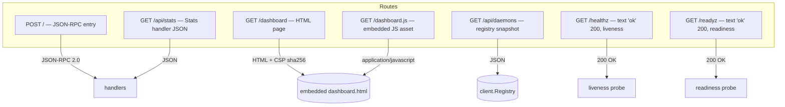

The dashboard is fully embedded — no asset pipeline, no remote
`<script src=>` references. Both the HTML and the JS are served
from `internal/transport/dashboard.go` constants (`DashboardHTML`,
`DashboardJS`) and reach the browser via two separate routes
(`/dashboard` and `/dashboard.js`) so the page can use
`script-src 'self'` without inline-hash maintenance.

What the page renders, polling `/api/stats` and `/api/daemons`:

- **Project selector** (top-right dropdown) — switches between all
  daemons listed in `~/.dfmt/daemons.json` so a single browser tab
  can monitor every project.
- **Headline cards** — Total Events, Session Duration.
- **MCP Byte Savings** — Raw Bytes, Returned Bytes, Bytes Saved,
  Compression %, Stash Dedup Hits.
- **LLM Token Metrics** — Input/Output Tokens, Cache Savings,
  Cache Hit Rate (populated only when callers pass token counts to
  `dfmt_remember`).
- **Events by Type / by Priority** — two simple bar charts.
- **Session Info** — Session Start/End timestamps. The full CSP header is:

```text
default-src 'self'; style-src 'self' 'unsafe-inline';
script-src 'self'; img-src 'self' data:; connect-src 'self';
frame-ancestors 'none'; base-uri 'none'
```

`X-Content-Type-Options: nosniff` and `X-Frame-Options: DENY` round
out the headers. Style allows `unsafe-inline` because the dashboard
ships a small embedded `<style>` block; scripts do not.

Listener selection is platform-aware:

- **Windows.** Always HTTP-over-TCP-loopback (`HTTPServer`). Default
  bind is `127.0.0.1:0` (ephemeral); set `transport.http.enabled=true`
  + `transport.http.bind=127.0.0.1:8765` to pin the port for a stable
  dashboard URL. Unix-domain sockets are technically supported but
  not the natural choice for PowerShell-friendly tooling.
- **Unix, default.** Unix-domain socket at `.dfmt/daemon.sock`
  (mode 0600, bound under umask 0o077 — closes F-05). Dashboard
  unavailable on this path because browsers can't dial a Unix
  socket.
- **Unix, opt-in TCP.** Set `transport.http.enabled=true` to switch
  to TCP loopback instead of the socket. Daemon refuses to run both
  simultaneously — the CLI client chooses dial target via presence
  of `.dfmt/port` (TCP) vs `.dfmt/daemon.sock`, and exposing both
  would make that choice ambiguous.

In every TCP path the loopback constraint is enforced inside
`transport.NewHTTPServer`'s listener phase; a non-loopback bind fails
fast. The server writes its actual port to `.dfmt/port`
(`{"port":N}`, mode 0600) so the CLI client can find it without
parsing logs.

#### Request-level security middleware

`HTTPServer.wrapSecurity` runs before every non-health-probe
handler. It exists because a TCP-loopback dashboard is reachable by
any browser the user opens — including a malicious page that
attempts DNS rebinding or cross-origin XHRs:

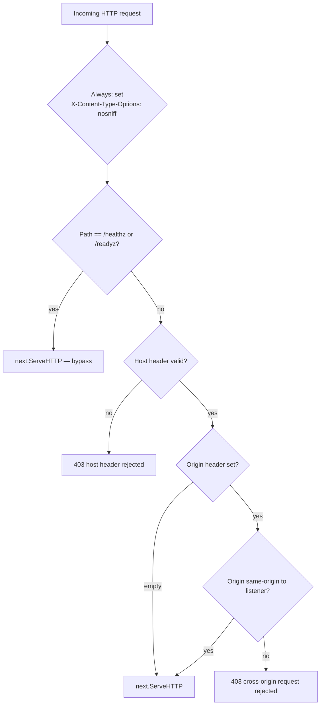

**Host validation (F-17 closure).** On TCP listeners, accepted
`Host` values are exactly: the literal listener address (e.g.
`127.0.0.1:54321`), `localhost:<port>`, or `[::1]:<port>`. Anything
else is 403. This blocks DNS rebinding: an attacker-controlled
domain that briefly resolves to `127.0.0.1` would arrive with
`Host: attacker.com` and be rejected. On Unix-socket listeners the
Host header is whatever the client put there — filesystem
permissions are the gate, not the header.

**Origin validation.** Cross-origin XHRs are refused unless the
`Origin` matches `http://<listener-address>`. Empty Origin (typical
for direct browser navigation, curl, server-to-server) passes.
Unix-socket listeners reject all non-empty origins outright since
there is no meaningful "same origin" notion for a Unix socket.

**Health probes bypass both checks** so liveness/readiness
monitoring tools can hit `/healthz` and `/readyz` without
masquerading as the dashboard.

### 7.3 Handlers (`internal/transport/handlers.go`)

The longest file in the project (≈ 1 450 lines). It is the actual
business logic:

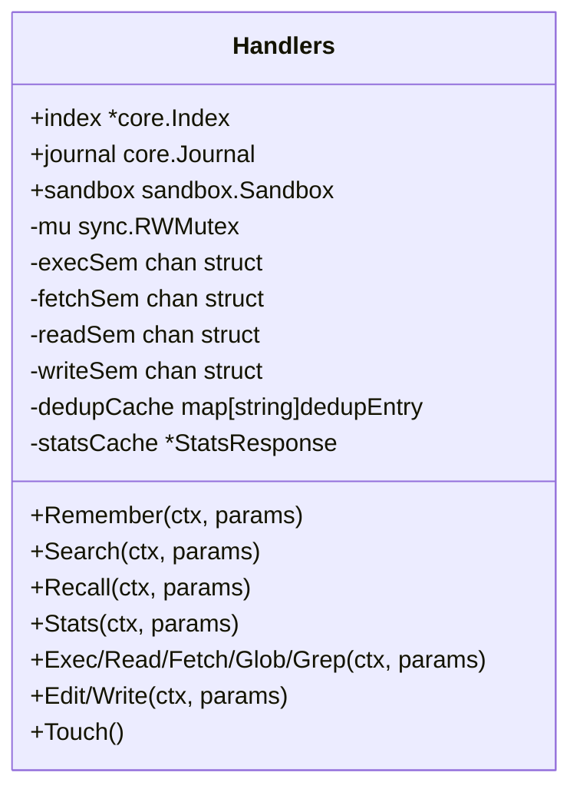

Important design choices:

- **Concurrency caps.** Buffered-channel semaphores: 4 concurrent
  `exec`, 8 `fetch`, 8 `read`, 4 `write`. An over-eager agent cannot
  DoS the host.
- **Server-side priority floor.** Agent-supplied `priority` on
  `Remember` is coerced to **P3** unless it is exactly `p2`, `p3`,
  or `p4`. The previous behavior — silently accepting any string
  including `p1` — let a prompt-injected agent claim the P1 band
  reserved for `decision` / `task.done` events the recall budget
  refuses to drop. P3 (not P4) is the fallback so legitimately
  surprising notes still beat routine tool calls under tight
  budget; the trade is a known false-elevation surface for malformed
  payloads.
- **Server-side Source override.** Whatever the agent puts in
  `params.Source` is **discarded** — the journal entry is always
  stamped `Source = mcp` because the agent IS calling via MCP and
  Source is a fact, not a parameter. Without this an agent could
  forge `source: "githook"` or `source: "fswatch"` and pass off
  noise as system-captured events.
- **Dedup window.** Identical `(kind, source, body)` triples within
  30 s and ≤ 64 distinct bodies share a single content-store entry.
  Cuts disk writes when an agent re-reads the same file twice.
- **Stats cache.** A 5 s TTL cache fronts `Stats()` because dashboard
  polling is aggressive and the journal walk is O(N).
- **Write hygiene.** `Write` events log SHA-256 + size, not the
  payload. Stops the journal from doubling as a leaked-secret store
  if an agent ever writes credentials.

### 7.4 JSON-RPC codec (`jsonrpc.go`, `rpc_params.go`)

A handwritten JSON-RPC 2.0 codec — one of the reasons DFMT keeps
the dependency list tiny.

**Frame discipline.** The wire is line-delimited: one JSON value
per line, terminated by `\n`. `Codec.readCappedLine` reads byte by
byte until `\n` or **`MaxJSONRPCLineBytes` (1 MiB)** — without the
cap a misbehaving peer that never sends a newline could grow the
read buffer without bound and OOM the daemon. The codec owns its
`bufio.Reader` and reuses it across calls so bytes buffered past a
line boundary (pipelined requests on the socket transport) are not
dropped on the next `ReadRequest` / `ReadResponse`.

`WriteRequest` / `WriteResponse` rely on `json.Encoder.Encode`,
which already appends a trailing newline. An earlier version
emitted an extra `"\n"` after the encode call, producing `{…}\n\n`
on the wire; the receiver then surfaced the bare second `\n` as an
empty frame, `json.Unmarshal` failed with "unexpected end of JSON
input", and `handleConn` closed the connection. The bug only hit
the socket transport's pipelined loop because single-shot HTTP
opens one request per connection.

**Strict params decoder (`decodeParams`).** Three guards:

| Guard                              | Behavior                                                                                                                          |
|------------------------------------|-----------------------------------------------------------------------------------------------------------------------------------|
| Empty / nil body                   | Accepted; `dst` is left at its zero value. RFC says a method may take no params — treating that as malformed would be wrong.      |
| `dec.DisallowUnknownFields()`      | A request with `{"limt":10}` instead of `{"limit":10}` previously returned a successful empty result (silent typo); now it fails. |
| `dec.More()` after first decode    | A second JSON value sharing the same line (rare but possible from buggy clients) is rejected as a malformed envelope.             |

Decode failures are wrapped as `*ParamsError`; the connection loop
uses `IsParamsError` (an `errors.As` shim) to map them to JSON-RPC
**`-32602`** ("Invalid params"). Bare `json.Unmarshal` errors that
are not `ParamsError` flow through to **`-32603`** ("Internal
error"). Before this split everything fell through to `-32603`,
which is wrong per RFC and made client-side typo diagnosis
impossible — `"internal error"` tells the caller nothing.

---

## 8. Core domain

### 8.1 Events

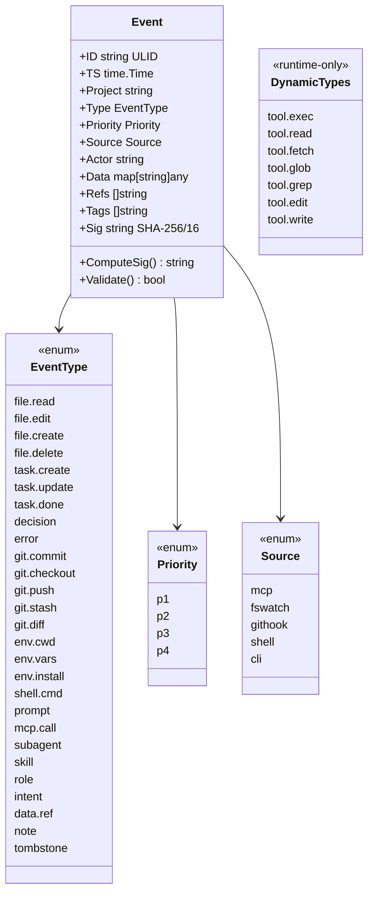

The `Sig` field is `sha256(canonical_json)[:16hex]` and is computed
inside `Append` (`internal/core/journal.go:190` — `e.Sig =
e.ComputeSig()` runs **before** marshal, so the value travels with
the event into the JSONL line). It is then **re-verified on every
read** by `Stream`/`scanLastID`: each line that decodes successfully
hits `if !e.Validate() { skip + journalWarnf }` at
`internal/core/journal.go:351`. Mismatches surface as warnings and
the offending event is skipped — the read paths and index replay no
longer trust JSON-decoded events on faith.

Backwards compatibility: events written before signing was wired
have `Sig == ""`. `Validate()` returns `true` for the empty-Sig case
so old segments replay cleanly; only **non-empty Sigs that disagree
with the recomputed canonical hash** trigger the warn-and-skip
path. The contract is "tampering detection," not "missing-signature
rejection."

Closes the read-path verification gap from earlier audits — the
daemon now catches in-place tampering at scan time, not just in
external tooling.

> **Three type spaces.** Three distinct sources of `Event.Type`
> strings show up in `journal.jsonl`:
>
> 1. **Named enum** (`core/event.go`, left column above): the
>    capture-source events — `file.read`, `git.commit`, `note`,
>    `prompt`, etc.
> 2. **`tool.*` sandbox calls** — emitted by `transport/handlers`
>    on every Exec/Read/Fetch/Glob/Grep/Edit/Write. Always
>    priority **P4**, source **mcp**, with `intent` in `Tags`.
>    Stats and the dashboard pivot on these strings to compute
>    byte savings, so renaming any of them is a wire-compat
>    change.
> 3. **`journal.rotate` tombstone** — written by `Rotate()` when
>    the active segment exceeds `MaxBytes` (see §8.3). Its `Data`
>    carries `{rotationID, ts}` and its ULID is intentionally
>    backdated 1 ms so it sorts before the post-rotation event
>    sequence in the new segment.
>
> All three flow through the same `Event` struct since `Type` is a
> raw string — the enum is convention, not validation.

> **Orphaned constants and builders.** `EvtShellCmd` (`shell.cmd`)
> is defined and has a `capture.ShellCapture.BuildCommand` helper,
> but **neither is called from production code**. The `dfmt capture
> shell` CLI subcommand exists, but it builds a `note` event (P4,
> source `shell`) with `cmd` / `cwd` in `data` — not an
> `EvtShellCmd`. The installed bash/zsh/fish hooks emit only
> `env.cwd` (`EvtEnvCwd`), not shell commands. The constant is
> reserved for a future feature; treat it as test-only today.
>
> The pattern extends to the rest of `internal/capture/`: every
> exported builder helper in `git.go` and `shell.go` —
> `NewGitCapture`, `BuildCommit`, `BuildCheckout`, `BuildPush`,
> `GitLog`, `NewShellCapture`, `BuildCommand`, `DetectShell` — is
> referenced **only** from `git_shell_test.go`. The live capture
> path bypasses these helpers entirely: shell/git hooks shell out
> to `dfmt capture …`, which dispatches to
> `internal/cli/dispatch.go::buildCaptureParams` and constructs the
> `RememberParams` inline (see §10.2 / §10.3). `internal/capture/`
> is effectively `fswatch.go` plus reserved scaffolding — see the
> Reserved code table at end of §18.

### 8.2 Classifier

`internal/core/classifier.go::Classify` walks the rule list first and
falls through to a `defaultPriorities` map keyed by event type only
on no rule match. The seeded rule list installed by `NewClassifier`
contains exactly two entries, both gated on `Type: EvtNote` plus a
tag whitelist:

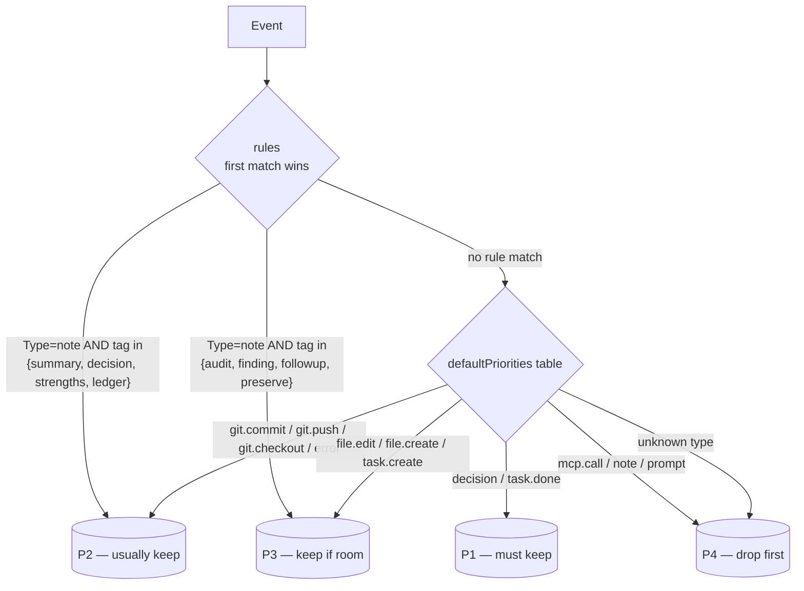

Note-only tag elevation is what makes `dfmt_remember` worth using
properly. A note tagged `summary` lands in P2 and survives a tight
recall budget; an untagged note stays at P4 and gets dropped first.
The whitelist is closed: a note tagged `important` or `keep-this`
will **not** elevate. To register a new elevation tag, edit
`noteElevateP2Tags` / `noteElevateP3Tags` in `classifier.go`.

The two seeded rules are inserted in priority order (P2 first, P3
second), so a note carrying both kinds of tags lands in P2 — first
matching rule wins. Custom rules added via `Classifier.AddRule`
append after the seeds; if a custom rule should override the
note-elevation defaults, callers need to mutate the slice directly
(no public reorder API today).

### 8.3 Journal

Append-only JSONL at `.dfmt/journal.jsonl`.

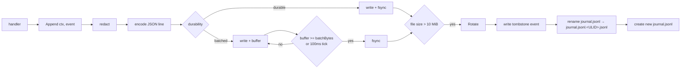

> **Compression flag is dead code.** `storage.compress_rotated` and
> the journal's internal `compress bool` are wired into the option
> struct but `Rotate()` never invokes any gzip path. Rotated
> segments stay as plain `.jsonl` on disk regardless of the
> setting. Treat the flag as reserved for a future feature.

**Rotate() detail.** The actual rotation sequence:

1. **No-op short-circuit** when `hiCursor == ""` (no events written
   since the last rotation — typical at idle restart).
2. **Tombstone event** appended to the active file: `Type =
   "journal.rotate"`, `Data = {rotationID: <hiCursor>, ts:
   <RFC3339Nano>}`. The tombstone's ULID is generated with
   `time.Now().Add(-time.Millisecond)` so its lexicographic ID
   sorts strictly before any subsequent post-rotation event a
   reader compares against.
3. **`Sync()` the tombstone** before close so a crash between
   rename and reopen leaves the rotated segment ending in a
   well-formed marker.
4. **Close → rename** active file to
   `journal.jsonl.<hiCursor>.jsonl` (the cursor IS the segment ID,
   not a fresh ULID).
5. **Reopen** new active file at original path with `O_APPEND |
   0o600`.
6. **Reset `hiCursor = ""`** so the next event's ID seeds the new
   segment's cursor.

The tombstone's payload (`type: "journal.rotate"`, an enum value
not in `event.go`) is a dynamic event type — a third one alongside
the named-enum events and the `tool.*` sandbox call types from
§8.1.

Two durability modes:

- **`durable`** — `fsync()` after every write. Survives kernel crash;
  every event is on disk before the handler returns.
- **`batched`** (default) — `fsync()` every 100 ms or every batch
  bytes. ≤ 100 ms data risk, much higher throughput.

A single event is capped at **`maxEventBytes = 1 MiB`**
(`internal/core/journal.go`). `Append` returns `ErrEventTooLarge`
above the cap — agents that try to journal a multi-megabyte stdout
get an explicit refusal, not a silent truncation.

**Recovery on open.** `OpenJournal` reuses any existing
`journal.jsonl` rather than truncating: `scanLastID` walks the file
to find the highest event ID and seeds `hiCursor` so subsequent
`Checkpoint` calls and rotations behave correctly. Crash mid-write
typically leaves a partial trailing line, which the scanner skips
(it scans past trailing junk to keep recovery robust).

**Append concurrency.** `Append`'s lock discipline is non-trivial:

1. **Marshal outside the lock** — `json.Marshal(e)` is CPU-bound
   and shares no state, so it runs lock-free; only the file write
   needs the mutex.
2. **Re-check `ctx.Err()` after lock acquire** — a caller that
   cancelled while waiting on `j.mu` does *not* sneak its append
   through after the cancel landed.
3. **Size limit check under the lock** — without this, two
   concurrent appends could both observe `Size() < maxBytes` and
   then push the journal past the cap (TOCTOU).
4. **`Sync()` only in `durable` mode** — `batched` mode relies on
   the `periodicSync` ticker (default 100 ms) running in a separate
   goroutine.
5. After a successful write, `j.hiCursor = e.ID` so the next
   `Checkpoint` returns this ID.

**Stream layout.** `Stream(ctx, from)` reads rotated segments
*before* the active file so callers see chronological history:

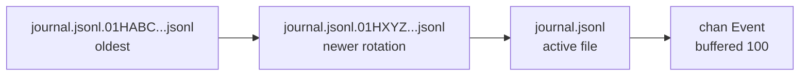

`journalSegments(activePath)` globs `journal.jsonl.*.jsonl`, sorts
lexicographically (ULID order = chronological), and appends the
active path last. An unreadable rotated segment is **skipped, not
fatal** — a single corrupt file doesn't black out subsequent
history. Per-line malformed JSON is logged at warn level
(`journalWarnf`) and skipped (V-9 closure: was silently dropped
before).

**Cursor pagination.** Passing a non-empty `from` to `Stream` skips
events until the ID matches `from`, then starts emitting. Used by
the index-rebuild path so a daemon restart only replays the tail
beyond the persisted cursor.

**Scanner buffer pinned to `maxEventBytes`.** `bufio.Scanner.Buffer`
is sized at exactly the same 1 MiB cap that `Append` enforces, so
a line longer than the cap is silently skipped by the scanner —
which doubles as a data-integrity guardrail: any line that would
exceed the cap is by definition corrupt or tampered, since `Append`
refuses to write it.

`Checkpoint(ctx)` returns `j.hiCursor` (the ID of the most-recently
appended event) under the lock. Callers persist this alongside the
index so the next start replays only the tail.

### 8.4 Index

`internal/core/index.go` is an in-memory inverted index plus a
trigram fallback. The interesting bits:

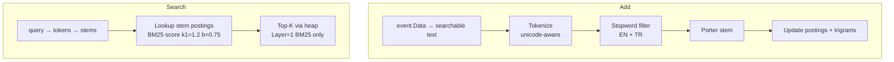

> **Trigrams have a fallback role today.** `Index.Add` populates a
> trigram posting list alongside the stem postings; `SearchBM25` walks
> `stemPL` first and the handler falls back to trigrams when BM25
> returns zero hits (`Layer: "trigram"`). See §8.5 for the layer rules.
> The `fuzzy` layer is unimplemented — its `core.Levenshtein`
> scaffolding was removed in ADR-0013.

**What text gets indexed.** `Index.eventText(e)` concatenates
(space-joined): `string(e.Type)` + every entry in `e.Tags` + every
**string-typed value** in `e.Data`. Non-string `Data` values (ints,
maps, nested structs) are silently skipped — an event whose payload
is `{"line_count": 42}` contributes nothing to the index beyond its
type and tags. Refs are also not indexed.

**Term-frequency width.** `PostingList.TFs` is `uint32`, not
`uint16`. The 65 536 ceiling matters in the wild: a journaled log
buffer that contains the same identifier 70 000 times (huge build
output, repeated panic stacks) would silently corrupt BM25 scoring
under `uint16`. The bigger field costs ~6 bytes per posting and
buys correctness on the long-tail.

**Add is idempotent.** A second `Add(e)` for an event ID already in
`docLen` is a no-op — prevents `totalDocs` drift and duplicate
posting entries when a caller (a retry path, an FSWatch
re-emission) submits the same event twice. The journal is the
authority; the index re-derives.

**Remove and avgDocLen drift.** `Index.Remove(id)` exists for the
rare path where an event must be retracted (tombstones, test
seams). It walks every posting list to splice out the entry, and
**recomputes `avgDocLen` from scratch** by summing surviving
`docLen` entries — incremental subtraction would drift over many
removes.

**Persist locking.** `Index.Persist(path)` does **not** hold
`ix.mu` across `json.Marshal`. `MarshalJSON` itself takes
`ix.mu.RLock()`, and Go's `RWMutex` starves a pending reader
behind a pending writer — re-entering RLock while already holding
it would deadlock under write contention. The marshal is
lock-free at the outer call; concurrent `Add`/`Remove` operations
can still race the snapshot, but the journal is the durable
truth, so a slightly-stale persisted index is safe.

Persistence (`index_persist.go`) uses **custom JSON** marshaling.
The original implementation tried `encoding/gob`, but Go's gob can't
encode unexported map fields and the index is mostly unexported by
design. Custom `MarshalJSON` / `UnmarshalJSON` hops through an
internal `indexJSON` struct so unexported fields can travel safely.

The on-disk filename is still `index.gob` for backwards
compatibility with older project directories.

`LoadIndexWithCursor` keeps a small `index.cursor` file with the ID
of the last indexed event **plus a `TokenVer` field** matching the
`TokenizerVersion = 1` constant in `index_persist.go`. On daemon
start, only the journal tail beyond the cursor is replayed — typical
startup re-indexes seconds, not minutes. **Bumping `TokenizerVersion`
forces a full rebuild on the next start** even if the cursor file is
fresh: tokens stemmed by an older Porter implementation would no
longer match new query stems, so silently keeping the index would
break search.

### 8.5 Search layers

The Search RPC accepts an optional `layer` parameter
(`bm25` / `trigram` / `fuzzy`). The default when `layer` is omitted
is **BM25 with trigram fallback**: BM25 runs first; if it returns
zero hits the handler retries the same query against the trigram
posting list and reports `Layer: "trigram"` so callers can
distinguish a true miss from a fallback hit
(`internal/transport/handlers.go::Search`). The fallback closes a
class of misses where BM25 silently drops synthetic markers
(`AUDIT_PROBE_XJ7Q3`), UUIDs, and other tokens that the Porter
stemmer mangles or splits. `fuzzy` is accepted for forward compatibility but returns no results
today; the earlier `core.Levenshtein` scaffolding was removed in
ADR-0013.
Default `limit` when omitted is 10.

Hits carry `id`, `score`, `layer` (integer rank), and an opt-in
**`excerpt`** field — a ≤80-byte rune-aligned snippet drawn from the
event's most caller-relevant text (`message` / `path` / `type`,
chosen by `Index.Excerpt(id)`). The excerpt is what makes
`dfmt_search` viable as a single round-trip discovery tool: an agent
gets the score *and* enough surrounding text to decide whether to
follow up with `dfmt_recall`, instead of paying a second wire round
to fetch the body. Events written before the excerpt feature land
with the field omitted (`omitempty`); the index can re-derive an
excerpt for legacy events on lookup if their data still satisfies
the indexer.

### 8.6 Tokenization

`TokenizeFull(s, stopwords)` is unicode-aware: any letter, digit,
or `_` joins the current token; everything else breaks it. Tokens
are kept if their length is between **2 and 64 characters**. Output
is lowercased before the stopword filter, then the Porter stemmer
runs on the survivors.

> **Three stopword lists, two wired today.** The codebase exposes:
>
> | Symbol                          | Location              | Entries  | Used in production?                                                                  |
> |---------------------------------|-----------------------|----------|--------------------------------------------------------------------------------------|
> | `englishStopwords` (unexported) | `sandbox/intent.go`   | ~60      | **Yes** — the intent-keyword extractor folds this with the Turkish set in `isStopword` |
> | `core.TurkishStopwords` (exported) | `core/core.go`     | 14       | **Yes** — `sandbox/intent.go::isStopword` calls it on every keyword extraction so Turkish "ile" / "için" / "olan" don't dominate vocabulary lists for Turkish-text inputs |
> | `core.EnglishStopwords` (exported) | `core/core.go`     | ~70      | **No** — only test files reference it; reserved for a future `Index.Add` opt-in path |
>
> Index-side production callers (`Index.Add`, `Index.SearchBM25`,
> `content.summarize`, `trigram.Add`) all pass `nil`, so the
> 70-entry exported English list never reaches indexed text. The
> *intent extractor* is the lone production caller of the bilingual
> filter today — sufficient for the keyword-matching path that
> drives `dfmt_search` excerpts and `ApplyReturnPolicy` matches, but
> the index proper still tokenizes raw. Wiring the index to the
> exported maps is a Reserved-code candidate (§18); doing it
> requires an ADR because it changes which terms appear in legacy
> projects' BM25 postings.

### 8.7 ULID generation (`internal/core/ulid.go`)

DFMT mints its own 16-byte sortable IDs in-process — the journal,
index, and content store all rely on the **monotonic-within-millisecond**
ordering it guarantees, so the implementation details are
load-bearing.

```mermaid
flowchart TB
    A[caller: NewULID(ts)] --> B[lock muGen]
    B --> C{ts.UnixMilli<br/>== lastTime?}
    C -- yes --> D["increment lastRandom[]<br/>(big-endian +1, cascade carry)"]
    C -- no --> E[lastTime = ms]
    E --> F[crypto/rand.Read lastRandom]
    F --> G{success?}
    G -- yes --> H[encode 16 bytes:<br/>6B ms + 10B random]
    G -- no --> I["fallback: pid<<32 | ctr<br/>XOR ts.UnixNano()"]
    I --> H
    D --> H
    H --> J[hex.EncodeToString → 32-char string]
    J --> K[unlock muGen, return]
```

Layout (16 bytes total):

| Bytes | Field         | Encoded as                                                |
|-------|---------------|-----------------------------------------------------------|
| 0–5   | timestamp     | 48-bit big-endian milliseconds since Unix epoch           |
| 6–15  | randomness    | 80 bits from `crypto/rand.Read`, or fallback (see below)  |

Encoded with `encoding/hex`, **not** Crockford Base32 — output is
**32 hex chars**, double the length of a spec-compliant 26-char
ULID. This is intentional (no external dependency), but external
inspectors that decode "real" ULIDs will reject these.

Three properties matter for callers:

- **Same-ms monotonic increment.** When two `NewULID` calls land in
  the same millisecond, the second does **not** re-roll randomness —
  it increments `lastRandom[9]` with carry cascading toward
  `lastRandom[0]` (`for i := 9; i >= 0; i--`). This is the mechanism
  behind the doc's recurring "ULID order = chronological" claim:
  without it, two events stamped with the same ms could sort in
  random order and the journal's `journalSegments()` lexicographic
  walk would lose chronology. It also lets `Rotate()` backdate the
  tombstone by 1 ms (§8.3) and trust that ordering holds.
- **Package-level serialization.** `lastTime`, `lastRandom`, and
  `ulidFallbackCtr` are package globals guarded by `muGen`. Every
  ULID minted in the daemon process — whether by the journal,
  content store, classifier, or capture pipeline — passes through
  this single mutex. For a single-tenant daemon the contention is
  invisible; multi-tenant rework would need to revisit it.
- **`crypto/rand` fallback.** If `rand.Read` fails (extremely rare
  outside of constrained sandboxes), DFMT does **not** crash. It
  logs once via `logging.Warnf`, increments `ulidFallbackCtr`, and
  derives `lastRandom` from a `pid<<32 | counter` mix XOR'd with
  `ts.UnixNano()`. IDs from this path remain unique-per-process
  (the counter guarantees it) but lose unpredictability — anyone
  using ULIDs as security tokens elsewhere should not, but DFMT
  doesn't.

`ULID.Time()` is the inverse: decode the first 6 bytes (12 hex
chars) back to `time.UnixMilli`. The journal uses this to convert
the cursor in `journal.jsonl.<ULID>.jsonl` segment names into
human-readable timestamps for `dfmt list-rotated`.

---

## 9. Sandbox

`internal/sandbox/` is the side-effect frontier. Seven operations
share one structure:

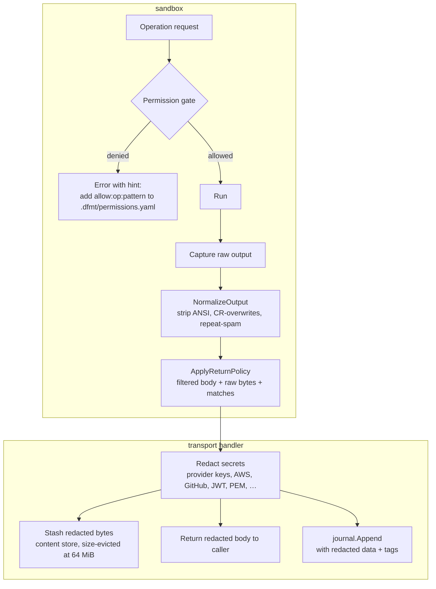

Redaction is **not** a sandbox step — the sandbox returns raw bytes
plus the return-policy-filtered body, then the transport handler
runs `h.redactString` / `h.redactData` on each output field before
stashing into the content store and appending to the journal. This
matters when reading the source: `internal/sandbox/permissions.go`
contains no `redact` calls; the redactor reference lives in
`internal/transport/handlers.go` and is held by `Handlers`, not by
`SandboxImpl`.

### 9.1 Default policy (`permissions.go`)

```yaml
allow:
  exec:
    # Core developer toolchain (each rule pairs `cmd` and `cmd *`):
    git, npm, pnpm, yarn, bun, npx, pnpx, bunx, deno
    pytest, cargo, go, node, python
    tsc, tsx, ts-node                  # TypeScript runners
    vitest, jest                        # JS/TS test runners
    eslint, prettier                    # JS/TS lint + format
    vite, next, webpack                 # bundler / dev server
    make
    # POSIX read-only shell helpers:
    echo, ls, cat, find, grep, dir, pwd, whoami, wc, tail
  read:  **
  write: **
  edit:  **
  fetch: https://*, http://*

deny:
  exec:  sudo *, rm -rf /*, "curl * | sh", "wget * | sh",
         shutdown *, reboot *, mkfs *, dd if=*,
         dfmt, dfmt *           # blocks recursive bypass
  read:  .env*, **/.env*, **/secrets/**, **/id_rsa, **/id_*
  write: same as read   +   .dfmt/**, **/.dfmt/**, .git/**, **/.git/**
  edit:  same as write  (F-29: edit is a write in disguise)
  fetch: http(s)://169.254.169.254/*       # AWS / IMDS
         http(s)://metadata.google.internal/*
         http://metadata.goog/*            # GCP
         file://*
```

The expanded JS/TS toolchain rules (`yarn`/`bun`/`npx`/`tsc`/
`vitest`/`eslint`/`vite`/…) are deliberate: without them every
TypeScript or modern-Node project would have to ship an override in
`.dfmt/permissions.yaml` just to run its own test runner, defeating
the zero-config posture. Only **direct invocation** is what the
extra rules cover — `npm run test` and `pnpm vitest` were already
allowed via the package-manager rules above.

A `LoadPolicy(path)` function exists in `permissions.go` to parse
the `allow:exec:base-cmd *` line format from
`.dfmt/permissions.yaml`, but as of this writing **the daemon does
not call it** — `sandbox.NewSandbox(projectPath)` always installs
`DefaultPolicy()` (see §13.4). Every denial error still ends with
a one-line hint pointing at `.dfmt/permissions.yaml`, on the
assumption that the loader will land in v0.3 (see [`docs/ROADMAP.md`](ROADMAP.md));
operators relying on those hints today will find their overrides
silently ignored.

### 9.1.1 Allow-rule trailing-space contract (V-20)

Every allow-list entry above ships in **pairs**: a bare `cmd` and a
`cmd *`. The space + `*` is the **end-of-token marker**, not a
glob-flair. Without it, `allow:exec:git` would match `git` but
**not** `git status` (`Match` would compare full string `"git status"`
against pattern `"git"` and reject), and a single `allow:exec:git*`
without the space would unsafely match `git-shell`,
`git-receive-pack`, or any `git`-prefixed binary on PATH.

The contract is therefore: **`<cmd>` allows the bare command,
`<cmd> *` allows the command followed by any arguments**. Operator-
written rules in `.dfmt/permissions.yaml` MUST follow the same
pattern. When you add a new exec allow, ship the pair:

```yaml
allow:
  exec:
    - mytool
    - mytool *
```

Closes V-20 from the validation pass — earlier drafts that wrote
`allow:exec:mytool*` (no space) accepted unwanted command-name
prefix collisions.

### 9.2 Recursive bypass

`dfmt` and `dfmt *` are on the deny list. Without that, an agent
could shell out to `dfmt exec '...'` from inside a sandboxed exec
and inherit a fresh, empty policy. The deny rule preserves the
"every operation is sandboxed" invariant.

### 9.3 Fetch SSRF defense

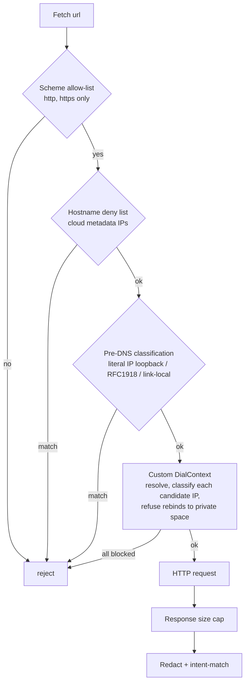

The DialContext step is the part most pure URL-checks miss: a remote
hostname can resolve to RFC1918 today and to public space tomorrow,
or vice versa. Resolution + classification happens at connect time,
so DNS rebinding cannot smuggle a request past the policy.

### 9.4 Intent extraction (`intent.go`)

Output filtering runs `NormalizeOutput` first to strip terminal
noise, then `ApplyReturnPolicy` to choose between inlining the body
and returning excerpts. The four `return` modes:

| Mode                | What gets populated                                                                                       |
|---------------------|-----------------------------------------------------------------------------------------------------------|
| `raw`               | `Body` only (full content, capped at 256 KiB / `MaxRawBytes` upstream). No summary, matches, or vocab.    |
| `search`            | `Matches` (up to 10) + `Vocabulary` (up to 20). **No body, no summary** — leanest mode.                   |
| `summary`           | `Summary` + `Matches` (up to 10) + `Vocabulary` (up to 20). **Never inlines body**, even for tiny content. |
| `auto` / `""` (default) | Tier-dependent (table below).                                                                          |

The default `auto` path is the interesting one — it's the policy
that closed the previous "empty intent silently returned full body"
token leak:

| Tier (by `ApproxTokens`)                     | `auto` behavior                                                                                                                            |
|----------------------------------------------|--------------------------------------------------------------------------------------------------------------------------------------------|
| ≤ `InlineTokenThreshold`                     | inline body only — no summary, matches, or vocab. The body is short enough that excerpts would just duplicate it.                          |
| `InlineTokenThreshold` – `MediumTokenThreshold` | summary + up to 5 matches + 10 vocab terms; signals merge ahead of keyword matches.                                                     |
| &gt; `MediumTokenThreshold`                  | summary + up to 10 matches + 20 vocab terms.                                                                                               |
| any non-inline tier with **zero matches**    | **Tail-bias fallback**: `Body` carries the last `TailBytes` of content. Covers verdict-at-the-end output (`go test`, `npm build`, CI logs) when neither keywords nor signals landed. |

**Tiering is by approximated tokens, not raw bytes** (ADR-0012,
`internal/sandbox/tokens.go`). The boundary function is

```
ApproxTokens(s) = ascii_bytes/4 + non_ascii_runes
```

— ASCII text amortizes ~4 bytes per BPE token, every non-ASCII rune
spends roughly one token on its own (CJK, Cyrillic, Turkish ç/ğ/ş,
Arabic, …). The earlier byte-cinsinden tier check handed CJK and
Turkish callers a doubled-up budget: a 4 KiB Japanese log was
inlined "because it's small," but cost the agent ~4× the tokens an
English log of the same byte count would. ApproxTokens normalizes
the inlay/excerpt boundary across scripts; the caller's *agent
budget* is what we're trying to protect, not the wire size.

I/O hard caps (`MaxFetchBodyBytes` 8 MiB, `MaxRawBytes` 256 KiB
Windows-truncation ceiling, `MaxSandboxReadBytes` 4 MiB) stay byte-
based — those defend the daemon against runaway sources, where
"how many bytes the OS gave us" is the relevant axis. Token budgets
defend the agent from the daemon, which is the orthogonal axis.

Matches are scored by BM25 against the `intent` keywords. **Kind-aware
signal promotion** is always on (`internal/sandbox/signals.go`):
anchored regexes for Go test runners (`^---\s+FAIL:\s`, `^panic:\s`,
`^fatal error:\s`), pytest tracebacks, cargo errors, generic
`error:` / `Error:` prefixes, and language-specific exception
headers fire on a trimmed line. Matches earn a synthetic
`SignalScore = 100.0` so they outrank any BM25 keyword hit
(`scoreLine` tops out near ~3.6), with up to `signalCap = 8`
signals merged ahead of the keyword matches. Net effect: a `go test`
run with no intent still surfaces which test failed. Vocabulary is
a small set of distinctive terms the caller can use to refine the
next call.

> **Where the `Summary` text comes from.** The string in
> `out.Summary` is produced by `sandbox.GenerateSummary(content,
> keywords)` (`internal\sandbox\intent.go`), not by the more elaborate
> kind-aware `content.Summarizer` in `internal\content\summarize.go`.
> `GenerateSummary` is intentionally simple: it counts non-blank lines,
> and either returns `"Total lines: N"` (no keywords) or
> `"Found K matching lines out of N total. Top matches:\nL{n}: …"`
> with up to 5 keyword-matching lines truncated to 80 chars each. The
> richer `content.Summarizer` (warnings detection, top-phrase
> extraction, kind-aware logic for `ChunkKindLog` / `ChunkKindMarkdown`)
> ships in the binary and is fully tested but is not currently wired
> to any production code path — only the package's own
> `summarize_test.go` and `store_test.go` instantiate it. It's a
> reserved capability, similar in status to the orphaned `retrieve`
> package called out in §11.1.

**`NormalizeOutput` (runs upstream of every return mode).** Ten
ordered passes in `internal/sandbox/intent.go::NormalizeOutput`,
each targeting a dominant noise class in shell- and HTTP-captured
output. The order is load-bearing — earlier passes assume UTF-8 text
and would break on binary input; later passes assume the body has
already been stripped of terminal animations:

1. **`CompactBinary`** (`binary.go`, **early-out**) — if the body
   is non-UTF-8 or carries a known magic number (PNG, PDF, gzip,
   ELF, Zip, JPEG, …), replace the entire payload with a one-line
   `(binary; type=…; N bytes; sha256=…)` summary and **return
   immediately**. Subsequent passes are no-ops on text, so they would
   waste cycles or produce nonsense on binary; the early-out makes
   the rest of the pipeline UTF-8-safe by construction.
2. **`stripANSI`** — removes CSI (`\x1b[...m`) and OSC escape
   sequences. Runs early so escape bytes can't split a downstream
   regex anchor (the redactor and `CompactGitDiff` both anchor on
   line starts).
3. **`collapseCarriageReturns`** — for every logical line, reduces
   `...A\rB\rC` runs to just `C` (per-line so a CR in line 3 can't
   eat line 1; trailing CRLF `\r` trimmed before the LastIndex scan
   so well-formed CRLF files aren't collapsed to empty).
4. **`runLengthEncode`** — collapses ≥ `rleMinReps` (4) consecutive
   identical lines to one + a `(repeated N times)` annotation.
   Targets spinner loops and retry-with-backoff bursts; threshold
   is 4 because two duplicates compress to longer than the original
   once the annotation is paid for.
5. **`CompactGitDiff`** (`diff.go`) — drops the `index <hash>..<hash>
   <mode>` line every `git diff` file-block emits. Pure wire noise
   for an LLM; no-op on non-diff input.
6. **`CompactStackTracePaths`** (`stacktrace.go`) — when ≥ 3
   consecutive Python or Go stack-trace frames share the same source
   path (recursive code), continuation frames get a short `…` marker
   instead of repeating the path verbatim. Conservative — flat
   traces stay verbatim.
7. **`CompactStructured`** (`structured.go`, ADR-0010) — when the
   body parses as a JSON object/array (or NDJSON), drop hypermedia
   noise (`*_url`, `_links`, pagination cursors), timestamp twins
   (`created_at` next to `updated_at`), Kubernetes housekeeping
   (`creationTimestamp`, `resourceVersion`, `selfLink`,
   `managedFields`), AWS pagination (`NextToken`), null/empty
   values. Targets `gh api`, `kubectl get -o json`,
   `aws ... --output json`. No-op on partial or non-JSON input.
8. **`CompactYAML`** (`structured.go`) — same drop-list applied to
   YAML-shaped bodies (`kubectl -o yaml`, `helm get manifest`).
   Detection is conservative: only fires when a `---` separator or
   `apiVersion:`/`kind:` header is present, so a regular config file
   passes through.
9. **`CompactMarkdownFrontmatter`** (`structured.go`) — strips
   leading YAML frontmatter (`---\nkey: …\n---`) from `.md` bodies.
   Detection is anchored at the very start so a `---` separator
   inside a CHANGELOG body stays intact.
10. **`ConvertHTML`** (`htmlmd.go`, ADR-0008) — when the body is
    HTML-shaped, run the bundled tokenizer (`htmltok.go`) and
    markdown walker. Drops `<script>` / `<style>` / `<nav>` /
    `<footer>` / `<aside>` / `<head>` / `<noscript>` / `<svg>` /
    `<form>` / `<button>` / `<iframe>` wholesale; emits markdown
    for headings, lists, code blocks (with language hint), tables
    (with GFM separator), blockquotes, definition lists, links,
    images. On cap-regression (output > input) falls back to the
    lite-path regex strip (`CompactHTML`) so the pipeline never
    inflates wire bytes.

The pipeline runs **before** `ApplyReturnPolicy` and the content-
store stash so neither has to budget tokens for terminal animations
or boilerplate HTML. It also runs **before** the redactor — escape
sequences and HTML tag boundaries can both split a secret across
positions and break the redactor's anchors.

### 9.4.1 Cross-call wire dedup (ADR-0009 / ADR-0011)

Two wire-saving steps stack on top of `NormalizeOutput`:

**Stash-side dedup (per-process, ADR-0009).** When the transport
handler stashes an output into the content store, it keys the
chunk-set ID on `sha256(kind, source, redacted_body)` for a 30-
second window (cap 64 distinct bodies). A repeated read of the same
file in a tight agent loop returns the **same `content_id`** instead
of writing a fresh chunk-set per call. The journal records each call
with the same `content_id`, so `dfmt_stats` accounting still
attributes raw/returned bytes to each call separately, but disk
writes collapse.

**Per-session wire dedup (ADR-0011).** The MCP layer also tracks
which `content_id`s the agent has *already received in this session*.
When a tool call would emit a body whose `content_id` is in that
seen-set, the response substitutes the literal sentinel
`(unchanged; same content_id)` for the body and the matches/vocab
arrays are still computed — but the bulk payload skips the wire.
Drops the cost of the common "agent re-reads file foo.go three
times in five turns" pattern from N×|body| down to |body| + (N−1)×27
bytes. The seen-set lives in `MCPProtocol.seenContentIDs`, is
process-lifetime, and is reset on `dfmt mcp` restart (i.e. when the
agent disconnects).

Set `DFMT_MCP_LEGACY_CONTENT=1` if you have a strict-MCP client
that ignores `structuredContent` and needs the duplicated text-
content envelope (the dedup mechanism still applies; only the
envelope shape changes).

### 9.5 Edit / Write atomicity

`internal/safefs/safefs.go` is the symlink-safe write helper.
Three exported functions, one threat model:

| Function                                        | What it does                                                                                       |
|-------------------------------------------------|----------------------------------------------------------------------------------------------------|
| `CheckNoSymlinks(baseDir, path)`                | Walks `path` segment-by-segment from `baseDir`, calling `Lstat` on each. Refuses any segment whose mode is `os.ModeSymlink` or any non-final segment that isn't a directory. Missing components stop the walk successfully (caller creates them). Inspection-only — no writes. |
| `WriteFile(baseDir, path, data, mode)`          | `CheckNoSymlinks` + `os.WriteFile`. Symlinks at any inspected component are refused. **TOCTOU residual**: between the Lstat check and `os.WriteFile`'s O_CREAT|O_TRUNC open, a sufficiently capable attacker could swap a symlink in. Documented in the package godoc. |
| `WriteFileAtomic(baseDir, path, data, mode)`    | `CheckNoSymlinks` + temp file in same dir + Sync + `os.Chmod` (best-effort on Windows) + `os.Rename` over the target. `rename(2)` **replaces** a pre-existing symlink at the leaf rather than writing through it, so this helper closes the TOCTOU window at the target itself. |

Trust model: **`baseDir` is trusted and not inspected**. Symlinks
*above* `baseDir` (notably macOS's `/var → /private/var`) are
accepted as system policy; only segments *below* are checked. Both
arguments must be absolute — relative inputs are refused.

`Edit` and `Write` from the sandbox call `WriteFileAtomic` (closes
F-R-LOW-1 from the security audit). `daemon.pid`, `.dfmt/port`, and
the `~/.dfmt/daemons.json` registry use `safefs.WriteFile` /
`WriteFileAtomic` for the same reason. Symlink targets in protected
paths (e.g. `.dfmt/`) are refused outright — that closed F-08,
which was the case where a malicious symlink turned a write into a
path traversal.

Tradeoff at `WriteFileAtomic`: rename-over breaks any pre-existing
hard links to the target (the file ID changes). Acceptable for
agent-driven file editing — hard links are rare in source trees and
the alternative (write-through) would re-open the symlink-leaf
attack the helper exists to close.

### 9.6 Sandbox environment passthrough and block-list

`buildEnv` (`permissions.go`) is the gate between the daemon's own
process environment and the subprocess that `dfmt_exec` launches.
The base set is **curated, not inherited**:

- Unix: `HOME`, `USER`, `PATH`, `LANG=en_US.UTF-8`, `TERM=xterm`.
- Windows: `PATH`, `TMP`, `TEMP`, `LOCALAPPDATA`, `USERPROFILE`,
  plus `HOME=$USERPROFILE` and `USER=$USERNAME` synthesized so
  Unix-style scripts work in Git Bash.

Every variable from the daemon's environment whose name starts with
`DFMT_EXEC_` is forwarded verbatim — the escape hatch for
operator-managed extras like `DFMT_EXEC_GOFLAGS` or
`DFMT_EXEC_NPM_TOKEN`. Anything else from the daemon's env is
**not** passed through.

Then the caller's `req.Env` map is merged in, but each name is run
through `isSandboxEnvBlocked` first. The block-list closes the
loader-/startup-hook injection vector: an agent that controls these
variables can effectively replace any allowed binary with arbitrary
code.

| Class                    | Blocked names / prefixes                                   |
|--------------------------|------------------------------------------------------------|
| Dynamic loader           | `LD_*`, `DYLD_*`                                           |
| Git internals            | `GIT_*` (covers `GIT_EXEC_PATH`, `GIT_SSH`, `GIT_INDEX_FILE`, …) |
| Node.js                  | `NODE_*` (covers `NODE_OPTIONS`, `NODE_PATH`, `NODE_TLS_REJECT_UNAUTHORIZED`) |
| npm                      | `NPM_CONFIG_*`                                             |
| Python                   | `PYTHON*` (covers `PYTHONSTARTUP`, `PYTHONPATH`, `PYTHONHOME`) |
| Ruby toolchain           | `RUBY*`, `BUNDLE_*`, `GEM_*`                               |
| Perl                     | `PERL5*`                                                   |
| Lua                      | `LUA_*`                                                    |
| PHP                      | `PHP*`, `COMPOSER_*`                                       |
| JVM                      | `JAVA_*`, `_JAVA_OPTIONS`                                  |
| Shell hooks              | `BASH_ENV`, `ENV`, `PS4`, `PROMPT_COMMAND`                 |
| Path / interpreter       | `PATH`, `IFS`, `PATHEXT`, `COMSPEC`                        |
| User identity            | `HOME`, `USER`, `USERPROFILE`, `APPDATA`, `LOCALAPPDATA`, `SYSTEMROOT` |

The list is closed by exclusion — an operator who allow-lists a new
interpreter (`ruby`, `php`, `java`) needs the corresponding env
prefix already in `sandboxBlockedEnvPrefixes`, otherwise the agent
can override the loader of that newly-allowed binary. F-G-LOW-2
from the security audit added the npm / bundle / gem / composer /
lua / java / php rows after the original list missed them.

### 9.7 Size and count caps

The sandbox enforces several hard limits the agent cannot raise:

| Constant                | Value      | Effect                                                                |
|-------------------------|------------|-----------------------------------------------------------------------|
| `MaxRawBytes`           | 256 KiB    | upper bound on `exec` stdout returned in `raw` mode                   |
| `MaxSandboxReadBytes`   | 4 MiB      | hard ceiling on `dfmt_read` regardless of the caller's `limit`        |
| `MaxFetchBodyBytes`     | 8 MiB      | response-body cap for `dfmt_fetch`                                    |
| `maxGlobInlineFiles`    | 500        | inline file-list cap; overflow surfaces a "(truncated)" sentinel match |
| grep match cap          | 100        | total `GrepMatch` results returned per call                           |
| `maxGrepLineBytes`      | 200        | per-line truncation in grep matches (minified JS / log lines)          |
| `maxGrepPatternBytes`   | 4096       | upper bound on the user-supplied regex source                         |
| `maxGrepPatternNodes`   | 1024       | parsed-AST node count cap (validates via `regexp/syntax`)             |
| `maxGrepRepeatNesting`  | 3          | nested-quantifier depth cap (`a*b*c*d*` is depth 4 → reject)          |
| HTTP redirect chain     | 10         | `http.Client.CheckRedirect` returns error on the 11th hop              |
| HTTP TLS handshake      | 10 s       | per-connection                                                         |
| HTTP idle conn          | 90 s       | keep-alive recycle window                                              |
| HTTP default timeout    | 30 s       | applied when caller passes `req.Timeout <= 0`                         |

The grep pattern complexity check uses `regexp/syntax.Parse` to
count AST nodes and the deepest repetition nesting, then rejects
patterns that would let an agent push the daemon into expensive
backtracking-style work even though Go's RE2 engine is linear-time
in input length.

### 9.8 Content store

`internal/content/store.go` is the post-sandbox stash that lets
agents fetch the *full* output of a tool call after the
intent-filtered version has already returned. The relationship is:

```mermaid
flowchart LR
    A[handlers.Exec / Read / Fetch] --> B["stashContent(kind, source, intent, redacted body)"]
    B --> C{TTL?}
    C -- "0 (default)" --> D[in-memory + persist to disk]
    C -- "&gt; 0" --> E[in-memory only]
    D --> F[<id>.json.gz<br/>0600, gzip-encoded JSON]
    E --> G[lazy expiry on Get]
    A --> H[returns content_id<br/>chunk-set ID]
    H --> I[agent later: fetch full body via content_id]
```

Key invariants:

| Aspect            | Behavior                                                                                   |
|-------------------|--------------------------------------------------------------------------------------------|
| Default cap       | 64 MiB total in-memory (`StoreOptions.MaxSize`); `evict()` drops oldest sets until the new chunk fits. |
| Persistence       | Sets with `TTL == 0` are persisted to `<dir>/<id>.json.gz` (mode 0600, **gzip-compressed JSON**). Sets with `TTL > 0` are memory-only. |
| Lazy expiry       | `GetChunk` / `GetChunkSet` check `set.Created + set.TTL` on every access; expired sets are dropped before returning a miss. |
| Bulk prune        | `PruneExpired()` walks the table and drops every expired set; `O(\|sets\|)` so cheap in practice. |
| ID validation     | `chunkIDPattern = ^[A-Za-z0-9_-]{1,128}$` — production callers pass ULIDs; the regex stops a caller from smuggling `..` / `/` / drive letters into a filesystem path. |
| Chunk kinds       | `markdown`, `code`, `json`, `text`, `log-lines` (`ChunkKind` enum).                        |
| Dedup at stash    | The transport handler keys `stashContent` by `sha256(kind, source, body)` for 30s with a cap of 64 distinct bodies — re-reads of the same file in a tight loop share one chunk-set ID instead of writing one per call. |

> **Compression scope.** `compress/gzip` *is* used here, despite
> being unwired in the journal-rotation path. The chunk-set
> `<id>.json.gz` files on disk are real gzip envelopes; an
> operator inspecting `.dfmt/content/` should `gunzip -c` to read
> them. The dead `storage.compress_rotated` flag from §13 only
> governs the journal's rotated `.jsonl` segments.

---

## 10. Capture pipeline

DFMT can capture events from five sources. All five funnel into the
same `journal.Append + index.Add` path, so downstream code does not
care where an event originated.

```mermaid
flowchart LR
    subgraph Sources
      M[MCP calls]
      C[CLI commands]
      F[FS watcher]
      G[Git hooks]
      S[Shell integration]
    end

    M --> R[redactor]
    C --> R
    F --> R
    G --> R
    S --> R

    R --> J[(journal)]
    R --> I[(index)]
```

| Source              | Implemented in                                     | Status     | Activation                              |
|---------------------|----------------------------------------------------|------------|-----------------------------------------|
| MCP calls           | `internal/transport/{mcp.go, handlers.go}`         | live       | always                                  |
| CLI commands        | `internal/cli/dispatch.go::buildCaptureParams`     | live       | always                                  |
| FS watcher          | `internal/capture/fswatch{,_linux,_windows}.go`    | live       | `capture.fs.enabled=true`               |
| Git hooks           | `internal/capture/git.go` + `cli/hooks_embed.go`   | live       | `dfmt install-hooks`                    |
| Shell integration   | `internal/capture/shell.go`                        | live       | `dfmt shell-init bash\|zsh\|fish` + `eval $(...)` |

### 10.1 FS watcher

```mermaid
flowchart TB
    subgraph Linux
        L1[inotify_init]
        L2[walk + add watches]
        L3[read events]
    end
    subgraph Windows
        W1[ReadDirectoryChangesW per watch root]
        W2[mod-time cache for static subtrees]
        W3[only re-walk dirs whose mtime changed]
    end

    Events["Events chan<br/>buffered 100"] --> Debounce
    Debounce[Per-path debounce<br/>map path → time<br/>cooldown = capture.fs.debounce_ms] --> Consume[consumeFSWatch]
    Consume --> J[(journal)]
    Consume --> I[(index)]

    L3 --> Events
    W1 --> Events
    W2 --> W3 --> Events
```

The Windows path is heavily optimized because `ReadDirectoryChangesW`
fires for every metadata blip, and naive consumers re-walk the tree
on each event. The mod-time cache means a static tree pays roughly
zero work after the first scan.

Debounce is per-path and non-blocking. Each path keeps a `time.Time`
in a small map; events within `capture.fs.debounce_ms` (default
**500 ms**) of the last one for the same path are dropped. A
cleanup goroutine evicts entries older than `10 × debounce_ms` so
the map cannot grow unbounded.

The `Events` channel is buffered at **100 events**. When
`consumeFSWatch` falls behind (e.g., heavy redact CPU on a big
text-paste burst), `FSWatcher.emit` is non-blocking — overflow
events are dropped and counted in an atomic `droppedEvents`
counter, surfaced via `FSWatcher.DroppedEvents()`. There is no
back-pressure on the OS-level watcher (`inotify` /
`ReadDirectoryChangesW`); kernel-buffer overflow there is reported
as a separate `IN_Q_OVERFLOW` event on Linux.

### 10.2 Git hooks

`dfmt install-hooks` writes three small shell scripts into
`.git/hooks/` from `internal/cli/hooks_embed.go`:

```mermaid
sequenceDiagram
    participant Git
    participant H as .git/hooks/post-commit
    participant CLI as dfmt capture
    participant D as daemon

    Git->>H: post-commit (after commit lands)
    H->>CLI: dfmt capture git commit <hash> <message>
    CLI->>D: client.Remember(EvtGitCommit, P2, ...)
    D->>D: journal.Append + index.Add
    D-->>CLI: ack
    CLI-->>H: exit 0
```

The three hooks pass slightly different positional arguments:

| Hook            | Invocation                                                          | Variable bindings inside the hook |
|-----------------|---------------------------------------------------------------------|-----------------------------------|
| `post-commit`   | `dfmt capture git commit "$COMMIT_HASH" "$COMMIT_MSG"`              | `COMMIT_HASH` = `git rev-parse HEAD`; `COMMIT_MSG` = `git log -1 --format=%s` |
| `post-checkout` | `dfmt capture git checkout "$REF" "$IS_BRANCH"`                     | `REF = $1` (git passes prev-HEAD ref as $1, new-HEAD ref as $2, flag as $3 — the script reads only `$1`); `IS_BRANCH` is `true`/`false` based on `git show-ref --verify --quiet refs/heads/$REF` |
| `pre-push`      | `dfmt capture git push "$REMOTE" "$BRANCH"`                         | `REMOTE = $1`; `BRANCH = git symbolic-ref --short HEAD` |

> **`post-checkout` quirk.** Git's documented hook contract sets `$1`
> to the **previous** HEAD ref, `$2` to the new one, and `$3` to a
> branch-vs-file flag. The shell script reads only `$1` and re-derives
> `IS_BRANCH` itself, so the journaled `ref` is the SHA of where the
> user came *from*, not where the checkout landed — and `is_branch` is
> almost always `"false"` because `refs/heads/<sha>` is rarely a real
> branch ref. Operators relying on `git.checkout` events to track
> branch destinations should treat the field as historical context,
> not destination identity.

The hooks rely on `command -v dfmt` for runtime PATH resolution —
they are emitted verbatim from the embedded
`internal/cli/hooks/git-*.sh` scripts and are **not** rewritten with
an absolute path at install time (`installHookContent` / 
`installShellHookContent` explicitly ignore the `dfmtBin` argument
they receive). A missing binary degrades each hook to a no-op
rather than failing the commit, and the `dfmt capture …` invocation
is backgrounded with `&` and stderr-suppressed with `2>/dev/null`
so neither a slow daemon-start nor an error message can block or
clutter `git`'s own output.

> **Different from MCP configs.** Per-agent MCP configs *do* pin an
> absolute path via `setup.ResolveDFMTCommand()` (§12), because the
> agent process spawns the binary directly with no shell in the
> middle. Git/shell hooks run inside a user shell that already has
> a PATH, so PATH lookup is the simpler and correct choice there.

### 10.3 Shell integration

`dfmt shell-init <shell>` prints a `here-doc` block for the user to
source. The actual hook scripts are embedded in the binary at
`internal/cli/hooks/{bash.sh,zsh.sh,fish.fish}` and are emitted
**verbatim**: the hook scripts use `command -v dfmt` and `dfmt
capture env.cwd` directly, relying on PATH at runtime.

> **Dead-code quirk.** `runShellInit` calls `os.Executable()` and
> formats the result through `filepath.ToSlash`, then passes the
> resolved path to `installShellHookContent(raw, dfmtBin)`. That
> function's body is `_ = dfmtBin; return raw` — the absolute path
> is computed and immediately discarded. Same story as git hooks
> (§10.2): a single global PATH-resolved `dfmt` is the design, so
> the hooks degrade to a no-op if the binary is missing rather than
> failing the user's prompt. The `os.Executable()` call is residual
> from an earlier substitution implementation and could be removed
> alongside `installShellHookContent`'s parameter.

Bash (`hooks/bash.sh`) — wires a `PROMPT_COMMAND` callback:

```bash
PROMPT_COMMAND="dfmt_prompt_hook"

dfmt_prompt_hook() {
    if command -v dfmt >/dev/null 2>&1; then
        dfmt capture env.cwd "$PWD" 2>/dev/null
    fi
}
```

> **Note for operators.** The bash hook **overwrites** `PROMPT_COMMAND`
> rather than appending. If you already use `PROMPT_COMMAND` for
> something else, source the dfmt hook first and chain manually.

Zsh (`hooks/zsh.sh`) uses `add-zsh-hook precmd dfmt_precmd_hook` —
non-destructive, sits alongside any existing precmd hooks.

Fish (`hooks/fish.fish`) uses an event handler on directory change.

In all cases the hook fires a P4 `env.cwd` event whenever the
current working directory changes — the cheapest possible
integration that still tells future agents "the user navigated to
this folder".

---

## 11. Session memory and recall

The whole system exists to make `dfmt_recall` good. The recall
algorithm is **per-tier streaming with FIFO eviction** under a byte
budget:

```mermaid
flowchart TB
    A[journal.Stream] --> B{classify by priority}
    B --> P1Q[(P1 ring buffer<br/>cap 5000)]
    B --> P2Q[(P2 ring buffer<br/>cap 1000)]
    B --> P3Q[(P3 ring buffer<br/>cap 500)]
    B --> P4Q[(P4 ring buffer<br/>cap 500)]

    P1Q --> Render
    P2Q --> Render
    P3Q --> Render
    P4Q --> Render

    Render[Greedy fill under budget<br/>default 4096 bytes, no upper cap] --> Out[markdown / json / xml]
```

The ring buffer caps mean the streaming pass uses bounded memory —
even on a multi-million-event journal. The greedy fill walks the
buffers in priority order; when the budget is exhausted, lower-tier
content is left out.

The format defaults to markdown because the consumer is usually an
AI agent that has just been compacted. JSON / XML are available for
tools.

### 11.1 Where recall actually runs

The streaming + FIFO eviction + render loop above all live in
`internal/transport/handlers.go::Recall` (around lines 555–686).
That handler:

1. Streams `journal.Stream` directly into four tier buckets with the
   caps shown in the diagram.
2. Concatenates buckets in priority order, reverse-iterating each
   bucket so newest-within-tier surfaces first.
3. Renders compact markdown lines inline (`- [P1] 04-27 22:38:23
   @actor #tag {data}`) into a single `RecallResponse.Snapshot`
   string, breaking when the byte budget would be exceeded.

The `format` request parameter is accepted but currently informational
only — `handlers.Recall` always emits markdown, regardless of whether
the caller asked for `md`, `json`, or `xml`. The parallel
`internal/retrieve/` package (with `SnapshotBuilder`, `MarkdownRenderer`,
`JSONRenderer`, `XMLRenderer`) is **not imported anywhere outside its
own `_test.go`** — the production wiring went straight through the
transport handler. Treat the `retrieve` package as a reserved, parallel
implementation; its renderers do not participate in either the MCP
`dfmt_recall` path or the CLI `dfmt recall` command.

### 11.2 Session-continuity loop (Claude Code)

`dfmt init` writes a project-local `.claude/settings.json` that
hooks Claude Code's three lifecycle phases. Together they form a
closed loop so a new session can pick up where the previous one
ended even after a context compaction:

```mermaid
sequenceDiagram
    autonumber
    participant CC as Claude Code
    participant H as .claude/settings.json hooks
    participant DF as dfmt CLI
    participant Recall as .dfmt/last-recall.md
    participant J as journal

    rect rgb(240,248,255)
    Note over CC,J: Mid-session — every tool call
    CC->>H: PreToolUse({tool_name, args})
    H->>DF: dfmt capture tool (5s timeout)
    DF->>J: append note event<br/>tags=[<tool_name>]
    end

    rect rgb(255,250,240)
    Note over CC,Recall: Compaction trigger (~80% context)
    CC->>H: PreCompact()
    H->>DF: dfmt recall --save --format md (30s timeout)
    DF->>J: stream + classify by tier
    DF->>Recall: write 0600 markdown snapshot
    end

    rect rgb(245,255,245)
    Note over CC,Recall: Next session start
    CC->>H: SessionStart()
    H->>Recall: cat .dfmt/last-recall.md (10s timeout)
    Recall-->>CC: prepended into new session
    end
```

The three hooks and their commands (templated by OS — POSIX shell
on Unix/macOS, PowerShell on Windows):

| Hook | Command | Timeout |
|------|---------|---------|
| `PreToolUse` (matcher `""` — fires on every tool) | `dfmt capture tool` | 5 s |
| `PreCompact` (fires before Claude Code compacts the conversation) | `dfmt recall --save --format md` | 30 s |
| `SessionStart` (fires when the user opens a new conversation) | POSIX: `if [ -f .dfmt/last-recall.md ]; then echo '--- Previous session summary ---' && cat .dfmt/last-recall.md && echo '--- End of previous session ---'; fi` (PowerShell equivalent on Windows) | 10 s |

The same `.claude/settings.json` carries DFMT's MCP allow-list
(`mcp__dfmt__dfmt_exec` through `mcp__dfmt__dfmt_write`, 11 entries)
so the agent can call DFMT tools without per-call permission
prompts. File mode is `0o600`.

### 11.3 Native vs MCP tool tracking

The `PreToolUse` hook above lets DFMT count *every* tool the agent
invokes — including Claude Code's built-in `Bash` / `Read` /
`Write` / `Glob` / `Grep` / etc. that bypass DFMT's MCP routing.
Each such call lands in the journal as a `note` event with the
tool name in `Tags`. `Stats` walks the journal and pivots the
tags against a known native-tool set:

```go
// internal/transport/handlers.go
var knownNativeTools = map[string]struct{}{
    "Bash": {}, "Read": {}, "Edit": {}, "Write": {}, "Glob": {},
    "Grep": {}, "WebFetch": {}, "WebSearch": {}, "TaskCreate": {},
    "TaskUpdate": {}, "TaskDone": {}, "Agent": {},
}
```

The aggregated counts surface in the `StatsResponse`:

| Field                  | Meaning                                                       |
|------------------------|---------------------------------------------------------------|
| `native_tool_calls`    | map of `tool_name → count` for the 12 built-ins above         |
| `mcp_tool_calls`       | map of `tool.exec` / `tool.read` / etc. → count               |
| `native_tool_bypass_rate` | `sum(native) / (sum(native) + sum(mcp))` as a percentage   |

The dashboard renders all three. A high `native_tool_bypass_rate`
means the agent is doing work that DFMT could have token-saved but
didn't get the chance to — usually because the agent's CLAUDE.md /
AGENTS.md routing instructions slipped or because the user pasted
an instruction that overrode them. This is *measurement*, not
enforcement: DFMT cannot force Claude Code to route through MCP.

---

## 12. Agent setup

`internal/setup/` auto-detects nine agents and writes the MCP
configuration each one expects.

```mermaid
flowchart TB
    A[dfmt setup or quickstart] --> B[setup.Detect]
    B --> C{For each agent}
    C --> D{Detected?}
    D -- no  --> E[skip]
    D -- yes --> F[write MCP config]
    F --> G[record path in manifest]
    G --> H["~/.local/share/dfmt/setup-manifest.json"]
    H --> I{is Claude Code?}
    I -- yes --> J[surgical patch ~/.claude.json<br/>+ ~/.claude/settings.json hooks]
    I -- no  --> K[done]

    L[dfmt setup --uninstall] --> M[load manifest]
    M --> N[strip files / restore backups]
    N --> O[clear manifest]
```

| Agent ID      | Files written                                                         | Notes                                            |
|---------------|-----------------------------------------------------------------------|--------------------------------------------------|
| `claude-code` | `~/.claude/mcp.json` (primary) + `~/.claude.json` (patched, user scope) + project `.claude/settings.json` (init-time hooks) | `.dfmt-bak` backup taken on first patch.        |
| `cursor`      | `~/.cursor/mcp.json`                                                  |                                                  |
| `vscode`      | `~/.vscode/mcp.json`                                                  | Copilot / VS Code MCP.                           |
| `codex`       | `~/.codex/mcp.json`                                                   | Codex CLI.                                       |
| `gemini`      | `~/.gemini/mcp.json`                                                  |                                                  |
| `windsurf`    | `~/.windsurf/mcp.json`                                                |                                                  |
| `zed`         | `~/.config/zed/mcp.json`                                              |                                                  |
| `continue`    | `~/.config/continue/mcp.json`                                         |                                                  |
| `opencode`    | `~/.config/opencode/mcp.json`                                         |                                                  |

Every config carries the same shape:

```json
{
  "mcpServers": {
    "dfmt": {
      "command": "<absolute path to dfmt resolved at setup time>",
      "args": ["mcp"]
    }
  }
}
```

The `command` field is set by `setup.ResolveDFMTCommand()`. Resolution
order: `exec.LookPath("dfmt")` → `os.Executable()` → literal `"dfmt"`.
Writing absolute paths makes MCP launches PATH-independent — the
agent spawns the exact binary that was on PATH at setup time, even
if a later login shell ends up with a different PATH.

`~/.claude.json` is special: it is shared across many Claude
features and the setup code patches it surgically (writing a
`~/.claude.json.dfmt.bak` backup before the first successful patch).
It is intentionally **not** added to the manifest, because the
manifest-based uninstall calls `os.Remove` on every tracked path
and `~/.claude.json` is a user-owned file — only `mcpServers.dfmt`
is stripped on uninstall.

The project-local `.claude/settings.json` is created by `dfmt init`
and carries the DFMT MCP allow-list plus the `PreCompact` and
`SessionStart` hook references. The user-home `~/.claude/settings.json`
is **never** modified — `WriteProjectClaudeSettings` refuses to write
under `$HOME/.claude/`.

`dfmt doctor` is the inspection counterpart: it reports per-agent
wire-up status (does the manifest-recorded file still exist? does
the binary path resolve?), plus project-level health (config valid,
journal openable, index loadable, lock file fresh).

### 12.1 Project instruction file injection

In addition to the per-agent MCP configs above, `dfmt setup` also
injects a marker-delimited DFMT routing block into the project's
agent-instruction files (`internal/setup/projectdocs.go`):

| File                                  | Format            | Marker                             |
|---------------------------------------|-------------------|------------------------------------|
| `CLAUDE.md`                           | Markdown          | `<!-- dfmt:v1 begin --> … <!-- dfmt:v1 end -->` |
| `AGENTS.md`                           | Markdown          | same                               |
| `GEMINI.md`                           | Markdown          | same                               |
| `.github/copilot-instructions.md`     | Markdown          | same                               |
| `.cursorrules`                        | Plain text        | `# dfmt:v1 begin` … `# dfmt:v1 end`|
| `.windsurfrules`                      | Plain text        | same                               |

The block contains the "use `dfmt_*` tools instead of native ones"
contract that makes a session honor MCP routing. Each entry is
recorded in the manifest with `Kind: FileKindStrip` so uninstall
**only removes the block**, leaving the rest of the file (and any
content the user added before or after the markers) untouched. If
the file becomes empty after stripping (DFMT was the sole resident),
it is removed.

Files written from scratch by DFMT (`~/.claude/mcp.json`,
`~/.codex/mcp.json`, etc.) carry `Kind: FileKindDelete` instead, so
uninstall removes them outright (with `.dfmt.bak` restore where one
exists).

Backups are written by `setup.BackupFile(path)`: if `path` exists,
its bytes are copied to `<path>.dfmt.bak` *next to* the original.
If a `.dfmt.bak` already exists from an earlier run, it is rolled
to `.dfmt.bak.<unix-nano>` rather than overwritten — repeated
re-runs preserve every prior version. The helper refuses to follow
symlinks at the backup target (closes a same-host path-traversal
attack where `path.dfmt.bak` is a symlink to e.g. `/etc/cron.d/x`).

### 12.2 Auto-init (`ensureProjectInitialized`)

Every CLI subcommand that needs project state, plus `dfmt mcp`
startup itself, calls `ensureProjectInitialized(dir)` (in
`internal/cli/dispatch.go`). The function is **idempotent and
non-destructive**:

1. Create `.dfmt/` at mode 0700 (no-op if it exists).
2. Write `.dfmt/config.yaml` from `DefaultConfigYAML()` **only if
   missing** — a user-customised config is never clobbered.
3. Append `.dfmt/` to `.gitignore` **only if `.gitignore` already
   exists** — DFMT will not create a `.gitignore` unprompted; that
   is the user's call. The "is `.dfmt` already ignored?" check is
   `project.IsDfmtIgnored` (`gitignore.go`), which walks the file
   line-by-line, skips comments and blanks, accepts the four
   canonical spellings (`.dfmt`, `.dfmt/`, `/.dfmt`, `/.dfmt/`),
   and honours **last-match-wins negation** (`!.dfmt` after an
   earlier `.dfmt` rule reverses to "not ignored", so DFMT will
   re-append). V-6 closure: the previous `bytes.Contains(content,
   ".dfmt/")` substring check produced false positives (a comment
   mentioning `.dfmt/` defeated the append) and false negatives
   (entries without trailing slash never matched).
4. Merge DFMT's tool-allowlist + hooks into project-local
   `.claude/settings.json` via
   `setup.writeProjectClaudeSettings(dir)`
   (`internal/setup/projectinit.go`). The merge is **structural,
   not destructive**: any pre-existing user keys
   (`mcp.callTimeoutMs`, `defaultMode`, `outputStyle`, statusline
   commands, custom permission entries, …) are preserved verbatim;
   DFMT's MCP tool allow entries and the `PreToolUse` /
   `PreCompact` / `SessionStart` hooks are union-merged with
   duplicate detection so re-running auto-init is a true no-op.
   The helper **refuses to write under `$HOME/.claude/`** so the
   user-scope settings file the agent shares across projects is
   never touched (commit aacb1a6 closed the previous clobber bug
   where DFMT overwrote the user's whole settings file when
   auto-init ran in a folder under `$HOME/.claude/`).

The auto-init path means an agent dropped into any random folder
gets a working DFMT setup on the first MCP call without the user
having to remember to run `dfmt init`.

### 12.3 Uninstall sequence (`dfmt setup --uninstall`)

The uninstall is manifest-driven and runs in a fixed order. The
ordering matters because some steps depend on data the previous
step writes/removes:

```mermaid
flowchart TB
    A[runSetupUninstall] --> B[setup.LoadManifest]
    B --> C{For each FileEntry}
    C --> D{f.Kind}
    D -- Strip --> E[StripDFMTBlock<br/>preserve user content,<br/>remove only marker block,<br/>delete file if empty]
    D -- Delete or empty --> F[os.Remove path]
    F --> G{path.dfmt.bak exists?}
    G -- yes --> H[os.Rename .dfmt.bak → path<br/>restores original]
    G -- no --> I[done]
    D -- unknown --> J[warn + skip]
    E --> K
    H --> K
    I --> K
    J --> K
    K[Done with manifest]
    K --> L[setup.UnpatchClaudeCodeUserJSON<br/>~/.claude.json — NOT in manifest]
    L --> M[setup.SaveManifest empty]
```

**`UnpatchClaudeCodeUserJSON`** does the surgical clean of the
shared `~/.claude.json`:

- Removes `mcpServers.dfmt` (top-level, user-scope).
- Removes `projects[*].mcpServers.dfmt` (per-project entries).
- Prunes `mcpServers` keys whose maps are now empty so the file
  doesn't accumulate `"mcpServers": {}` stubs across
  uninstall/reinstall cycles.
- **Deliberately preserves** the three trust flags
  (`hasTrustDialogAccepted`,
  `hasClaudeMdExternalIncludesApproved`,
  `hasClaudeMdExternalIncludesWarningShown`) — DFMT cannot tell
  whether the user accepted them independently, so removing them
  would silently un-trust projects the user already trusts.
- Atomic tmp+rename so a concurrent Claude Code write cannot
  corrupt the file mid-update.

The "manifest excludes `~/.claude.json`" rule from §12.1 is what
makes this surgical clean necessary: a `FileKindDelete` entry would
have called `os.Remove` on that shared user file, blowing away
unrelated Claude Code state. Closes F-G-INFO-2 from the security
audit, where uninstall used to leave a stale `mcpServers.dfmt`
entry pointing at a now-missing binary, surfacing as "failed to
start MCP server" on the next Claude Code launch.

`dfmt setup --verify` (without `--uninstall`) is the read-only
counterpart: it walks the manifest and reports which tracked files
are still in place, which were removed externally, and which are
out of sync with the canonical block body. Used after a setup
re-run to confirm wire-up health without re-installing.

---

## 13. Configuration

Configuration is layered: built-in defaults → global
(`$XDG_DATA_HOME/dfmt/config.yaml` or `~/.local/share/dfmt/config.yaml`)
→ project (`.dfmt/config.yaml`). Project values win. The decoder is
strict (`KnownFields(true)`) — typos surface as load errors rather
than silently degrading.

Each config file is capped at **64 KiB** (`maxConfigBytes` in
`internal/config/config.go`). Files above the cap are rejected with
`config file too large: exceeds 65536 bytes` rather than truncated
— a giant config almost always means the file got corrupted or
mis-edited and silently using the first 64 KiB would mask the
problem.

The struct lives in `internal/config/config.go` and the defaults in
`internal/config/defaults.go::DefaultConfigYAML()`. Both `dfmt init`
and the daemon's auto-init use the same `DefaultConfigYAML`, so
there is exactly one source of truth.

### 13.0 Wired vs reserved fields

A non-trivial fraction of the config struct exists for forward
compatibility — the field is defined, gets a default, runs through
`Validate()`, but **no production consumer reads it**. Setting any
of these values in `.dfmt/config.yaml` is silently a no-op.

| Section / key                                    | Status                                                      |
|--------------------------------------------------|-------------------------------------------------------------|
| `capture.mcp.enabled`                            | wired                                                       |
| `capture.fs.enabled / watch / ignore / debounce_ms` | wired                                                    |
| `capture.git.enabled / capture.shell.enabled`    | wired (honored by `install-hooks` / `shell-init`)          |
| `storage.durability / max_batch_ms / journal_max_bytes` | wired (threaded into `OpenJournal`)                  |
| `storage.compress_rotated`                       | **unwired** — `Rotate()` never gzips (see §8.3)             |
| `lifecycle.idle_timeout`                         | wired                                                       |
| `lifecycle.shutdown_timeout`                     | **unwired** — `Stop()` uses a hardcoded `10*time.Second`    |
| `transport.mcp.enabled / http.enabled / socket.enabled` | wired                                                |
| `transport.http.bind`                            | wired                                                       |
| `index.bm25_k1 / bm25_b / heading_boost`         | **unwired** — `NewBM25Okapi()` hardcodes `1.2 / 0.75`       |
| `index.rebuild_interval / stopwords_path`        | **unwired**                                                 |
| `retrieval.default_budget / default_format`      | **unwired** — `Recall` uses hardcoded `4096` and `"md"`     |
| `retrieval.throttle.*` (4 fields)                | **unwired**                                                 |
| `privacy.telemetry / remote_sync / allow_nonlocal_http` | **unwired**                                          |
| `logging.level / logging.format`                 | **unwired** — `internal/logging` ignores them               |

The pattern is consistent: the config layer is more complete than
the daemon's plumbing, by design. New features can land their
config fields ahead of the consuming code, with `Validate()`
already enforcing sensible ranges, and the wiring lands later
without re-reviewing the schema. The flip side is that several
"obvious" knobs (BM25 tuning, default recall budget, log level)
look configurable but aren't yet.

### 13.1 Schema (Go struct → YAML key)

| Section       | Key                              | Type     | Default            | Notes                                              |
|---------------|----------------------------------|----------|--------------------|----------------------------------------------------|
| `version`     | `version`                        | int      | `1`                | Schema version.                                    |
| **capture**   | `capture.mcp.enabled`            | bool     | `true`             | Always recommended.                                |
|               | `capture.fs.enabled`             | bool     | `false`            | Opt-in. Watches the project tree.                  |
|               | `capture.fs.watch`               | []string | `["**"]`           | Globs to include.                                  |
|               | `capture.fs.ignore`              | []string | `[".git/**", "node_modules/**", "__pycache__/**"]` | **Must** include `.dfmt/**` (else self-loop). |
|               | `capture.fs.debounce_ms`         | int      | `500`              | Per-path cooldown.                                 |
|               | `capture.git.enabled`            | bool     | `true`             | Honored by `dfmt install-hooks`.                   |
|               | `capture.shell.enabled`          | bool     | `true`             | Honored by `dfmt shell-init`.                      |
| **storage**   | `storage.durability`             | string   | `"batched"`        | `"durable"` or `"batched"`. Validated.             |
|               | `storage.max_batch_ms`           | int      | `100`              | Max delay between fsyncs in batched mode.          |
|               | `storage.journal_max_bytes`      | int64    | `10485760` (10 MiB)| Trigger for rotation.                              |
|               | `storage.compress_rotated`       | bool     | `true`             | **Unwired** — `Rotate()` never invokes gzip.        |
| **retrieval** | `retrieval.default_budget`       | int      | `4096`             | **Unwired** — `Recall` uses hardcoded 4096.        |
|               | `retrieval.default_format`       | string   | `"md"`             | **Unwired** — `Recall` uses hardcoded `"md"`.      |
|               | `retrieval.throttle.first_tier_calls`   | int | `10`            | **Unwired**.                                       |
|               | `retrieval.throttle.second_tier_calls`  | int | `5`             | **Unwired**.                                       |
|               | `retrieval.throttle.results_first_tier` | int | `20`            | **Unwired**.                                       |
|               | `retrieval.throttle.results_second_tier`| int | `10`            | **Unwired**.                                       |
| **index**     | `index.rebuild_interval`         | string   | `"1h"`             | **Unwired** — no scheduled rebuild path.           |
|               | `index.bm25_k1`                  | float64  | `1.2`              | **Unwired** — `NewBM25Okapi` hardcodes 1.2.        |
|               | `index.bm25_b`                   | float64  | `0.75`             | **Unwired** — `NewBM25Okapi` hardcodes 0.75.       |
|               | `index.heading_boost`            | float64  | `5.0`              | **Unwired** — no scoring path consumes it.         |
|               | `index.stopwords_path`           | string   | `""`               | **Unwired** — stopwords are baked-in constants.    |
| **transport** | `transport.mcp.enabled`          | bool     | `true`             | stdio MCP server.                                  |
|               | `transport.http.enabled`         | bool     | `false`            | Opt-in HTTP loopback.                              |
|               | `transport.http.bind`            | string   | `"127.0.0.1:8765"` | Bind address.                                      |
|               | `transport.socket.enabled`       | bool     | `true`             | Unix socket (Unix only).                           |
| **lifecycle** | `lifecycle.idle_timeout`         | duration | `"30m"`            | Validated parseable by `time.ParseDuration`.       |
|               | `lifecycle.shutdown_timeout`     | duration | `"10s"`            | **Unwired** — `Stop()` uses hardcoded `10*time.Second`. |
| **privacy**   | `privacy.telemetry`              | bool     | `false`            | **Unwired**. DFMT never phones home regardless.    |
|               | `privacy.remote_sync`            | string   | `"none"`           | **Unwired**.                                       |
|               | `privacy.allow_nonlocal_http`    | bool     | `false`            | **Unwired**. Loopback enforcement happens in transport, not via this flag. |
| **logging**   | `logging.level`                  | string   | `"info"`           | **Unwired** — but see callout below: log level is set via `DFMT_LOG` env var, not this field. |
|               | `logging.format`                 | string   | `"text"`           | **Unwired** — output format is hard-coded `<level>: <message>\n` for legacy compatibility. |

### 13.1.1 Logging is configured via env, not config

The `internal/logging` package itself works fine — it has
`Debugf` / `Infof` / `Warnf` / `Errorf`, all writing
`<level>: <message>\n` to stderr. The threshold is read once at
process startup from the **`DFMT_LOG`** environment variable:

| `DFMT_LOG` value             | Threshold                                    |
|------------------------------|----------------------------------------------|
| `debug`                      | `LevelDebug` — verbose                       |
| `info`                       | `LevelInfo`                                  |
| `warn` / `warning`           | `LevelWarn` (default)                        |
| `error`                      | `LevelError`                                 |
| `off` / `none` / `silent`    | `LevelOff` — completely silent               |

The `logging.level` and `logging.format` config fields would be a
nicer place to put this, but the wiring isn't there yet (see §13.0).
Operators silencing daemon stderr in CI dashboards should export
`DFMT_LOG=error` or `DFMT_LOG=off`.

### 13.2 Default `.dfmt/config.yaml` (as written by `dfmt init`)

The default file is intentionally minimal — it sets only the values
where a sane default differs from the zero-value. Everything else
is populated from the struct defaults at load time.

```yaml
# DFMT Configuration
version: 1

capture:
  mcp:
    enabled: true
  fs:
    enabled: false           # opt-in; flip to true to start watching
    watch:
      - "**"
    ignore:
      - ".dfmt/**"           # MANDATORY: prevents self-loop
      - ".git/**"
      - "node_modules/**"
      - "vendor/**"
      - ".venv/**"
      - "venv/**"
      - "__pycache__/**"
      - "*.pyc"
      - "dist/**"
      - "build/**"
      - "target/**"
      - "out/**"
      - ".next/**"
      - ".nuxt/**"
      - ".turbo/**"
      - "coverage/**"
      - ".idea/**"
      - ".vscode/**"
      - "*.swp"
      - "*.swo"
      - "*.log"
      - "tmp/**"

storage:
  durability: batched
  journal_max_bytes: 10485760
```

### 13.3 Validation rules

`Config.Validate()` enforces:

- `storage.durability ∈ {"durable", "batched"}`
- `storage.max_batch_ms ≥ 0`
- `storage.journal_max_bytes ≥ 0`
- `lifecycle.idle_timeout`, `lifecycle.shutdown_timeout` parseable
  by `time.ParseDuration` (when set)
- `index.bm25_k1 ≥ 0`
- `index.bm25_b ∈ [0, 1]`
- `index.heading_boost ≥ 0`
- `retrieval.default_budget ≥ 0`

Invalid values cause `Load` to fail immediately so misconfiguration
never silently degrades behavior.

### 13.4 Optional sidecars (documented, not yet wired)

Two project-level overlay files are referenced throughout the code
and error hints, but as of this writing **neither is read at
daemon startup** — both are reserved for the next milestone:

- `.dfmt/permissions.yaml` — site-specific sandbox allow/deny rules
  in line-format `allow:exec:base-cmd *`. The parser
  (`internal/sandbox/permissions.go::LoadPolicy`) exists and is
  tested, but is **not called** from `daemon.New` — production
  sandboxes always load `DefaultPolicy()`. The denial-error hints
  ("add `allow:exec:<cmd> *` to .dfmt/permissions.yaml") are
  forward-looking.
- `.dfmt/redact.yaml` — additional regex/field redaction patterns.
  The redactor's `AddPattern` method exists, but no loader reads
  this file. Operators that need extra patterns today must build a
  custom binary or call `Redactor.AddPattern` from a fork.

Both files are reserved at 0600 if you create them, but `dfmt init`
does **not** scaffold them and the daemon will not pick them up.
Track [#permissions-loader](docs/adr/) and the redactor wiring
issue before relying on either.

---

## 14. On-disk layout

The canonical filenames are constants in
`internal/project/project.go`. The lock file name is hard-coded in
`internal/daemon/lock.go`. The HTTP port file is written by the
transport layer when `transport.http.enabled=true`.

```mermaid
flowchart TB
    subgraph Project[".dfmt/  — per project, 0700"]
        C[config.yaml<br/>0600]
        J[journal.jsonl<br/>0600 — append-only JSONL]
        Jr["journal.jsonl.&lt;ULID&gt;.jsonl<br/>rotated, plain JSONL (compress flag unwired)"]
        I[index.gob<br/>0600 — JSON payload, .gob filename retained]
        Ic[index.cursor<br/>0600 — last-indexed event ID]
        Sk[daemon.sock<br/>0600 — Unix socket, Unix only]
        Pid[daemon.pid<br/>0600 — running daemon PID]
        Cont["content/<br/>0700 — ephemeral chunk store<br/>64 MiB cap, size-evicted"]
        L[lock<br/>0600 — flock target / Win named handle]
        P[port<br/>0600 — HTTP port, only if http.enabled]
        Ph["permissions.yaml<br/>0600 — reserved, loader not wired"]
        R["redact.yaml<br/>0600 — reserved, loader not wired"]
    end

    subgraph UserXDG["$XDG_DATA_HOME/dfmt (or ~/.local/share/dfmt)"]
        Gc[config.yaml<br/>global overrides]
        M[setup-manifest.json<br/>tracks files installed by setup]
    end

    subgraph UserHome["~/.dfmt/  — note: separate from XDG path above"]
        Reg[daemons.json<br/>0600 — cross-project registry<br/>backs `dfmt list` and /api/daemons]
    end
```

| File                    | Owner / writer                                | Notes                                                  |
|-------------------------|-----------------------------------------------|--------------------------------------------------------|
| `config.yaml`           | `dfmt init` / user-edited                     | Project config; merged onto global + struct defaults.  |
| `journal.jsonl`         | `core.Journal`                                | Active append-only log.                                |
| `journal.jsonl.<ULID>.jsonl` | `core.Journal::Rotate`                  | Older segments. The `storage.compress_rotated` flag is currently a no-op (see §8.3). |
| `index.gob`             | `core.Index::Persist`                         | JSON payload — filename kept for backwards compat.     |
| `index.cursor`          | `core.Index::Persist`                         | Last indexed event ID; enables incremental load.       |
| `daemon.sock`           | `transport.SocketServer`                      | Unix socket, mode 0600 (umask 0o077 at bind).          |
| `daemon.pid`            | `daemon.Daemon::Start`                        | Atomic write via `safefs.WriteFile` (refuses symlinks).|
| `lock`                  | `daemon.AcquireLock`                          | `flock(2)` on Unix; LockFileEx on Windows.             |
| `port`                  | `transport.HTTPServer::writePortFile`         | JSON `{"port":N}`. Removed on shutdown.                |
| `permissions.yaml`      | operator                                      | Site-specific sandbox rules. **Reserved — loader not wired** (see §13.4). |
| `redact.yaml`           | operator                                      | Extra redaction patterns. **Reserved — loader not wired** (see §13.4). |

All project-level files are 0600. `.dfmt/` itself is 0700. `dfmt init`
adds `.dfmt/` to the project's `.gitignore` if it is not already
listed (idempotent merge in `internal/project/gitignore.go`).

User-level state actually lives in **two** distinct directories,
which is a historical wart worth knowing about:

- **`$XDG_DATA_HOME/dfmt/`** (defaults to `~/.local/share/dfmt/` on
  Unix, `%APPDATA%/dfmt/` on Windows) — holds the global
  `config.yaml` overrides and `setup-manifest.json` (per-agent file
  inventory for clean uninstall).
- **`~/.dfmt/`** — holds `daemons.json`, the cross-project registry
  consumed by `dfmt list` and `GET /api/daemons`. The `daemons.json`
  path is hard-coded in `internal/client/registry.go::registryPath`
  and does **not** follow XDG.

The split exists because the registry is a runtime state file (PIDs,
ports, socket paths) the user might also want to grep with `cat
~/.dfmt/daemons.json` from a shell, while the manifest is install
metadata that fits the XDG data convention.

### 14.1 Project ID and socket path fallback

Two derived values from `internal/project/discover.go` are worth
naming explicitly:

- **`ID(projectPath)`** — first 4 bytes of `SHA-256(path)` rendered
  as 8 hex characters. Used in dashboard URLs and as a stable
  short ID across machines for the same path.
- **`SocketPath(projectPath)`** — normally
  `<project>/.dfmt/daemon.sock`. Unix `UNIX_PATH_MAX` is 108 bytes
  on Linux and 104 on macOS, so if the full socket path exceeds
  **100 bytes** the function falls back to
  `<userRuntimeDir>/dfmt-<hash>.sock`, where the hash is 16 hex
  characters (8 bytes of SHA-256). `userRuntimeDir()` resolution:
  `$XDG_RUNTIME_DIR` → `$TMPDIR` → `os.TempDir()` (the last branch
  drops a per-user `dfmt-<uid>/` subdir at mode 0700 if the base
  path is shared like `/tmp`). Closes F-06 (predictable-path
  pre-creation by a same-host attacker on shared `/tmp`).

---

## 15. Concurrency model

```mermaid
flowchart TB
    subgraph Daemon
        D[daemon.Daemon]
        D --- mu[atomic running]
        D --- act[atomic lastActivityNs]
        D --- lk[sync.Mutex lock]
        D --- once[sync.Once stopOnce]
        D --- wg[sync.WaitGroup]
        D --- shut[chan shutdownCh]
        D --- idle[chan idleCh]
    end

    subgraph Goroutines
        G1[transport.Serve]
        G2[idleMonitor]
        G3[consumeFSWatch]
        G4[rebuildIndexAsync]
        G5[journal sync ticker]
    end

    subgraph Handlers
        H[Handlers]
        H --- hmu[sync.RWMutex]
        H --- es[execSem cap=4]
        H --- fs[fetchSem cap=8]
        H --- rs[readSem cap=8]
        H --- ws[writeSem cap=4]
        H --- dc[dedupCache + mu]
        H --- sc[statsCache 5s TTL]
    end
```

Patterns to know:

- **Atomics for hot reads.** `running` and `lastActivityNs` are the
  two values touched on every request. Both are atomic.
- **Channels for shutdown.** `shutdownCh` (close to broadcast) and
  `idleCh` (close to wake the monitor) replace `time.AfterFunc`,
  whose timer goroutine made early prototypes leak under churn.
- **WaitGroup for drain.** Stop waits for `consumeFSWatch` and
  `rebuildIndexAsync` before persisting the index — if rebuild was
  cancelled mid-way the cursor is intentionally left stale.
- **Per-resource semaphores.** Four buffered-channel semaphores in
  `Handlers`, **shared across operation families** rather than
  per-MCP-tool:

  | Semaphore  | Cap | Operations served                  |
  |------------|-----|------------------------------------|
  | `execSem`  | 4   | `Exec`                             |
  | `fetchSem` | 8   | `Fetch`                            |
  | `readSem`  | 8   | `Read`, `Glob`, `Grep`             |
  | `writeSem` | 4   | `Edit`, `Write`                    |

  Acquired through `acquireLimiter(ctx, sem)` which `select`s on
  `sem <- struct{}{}` vs `ctx.Done()`. Client cancellation
  immediately returns the context error without ever holding a
  slot, so an aborted RPC never starves the next one. Release is
  a deferred `<-sem`.

---

## 16. Security posture

DFMT's threat model is "agent inside the box, attacker outside" —
the agent is trusted to run code it intends to run, but the host
must be protected from agent mistakes (and from prompt-injected
agents).

```mermaid
flowchart TB
    subgraph Agent
        A[AI agent intent]
    end

    subgraph DFMT Defenses
        P[Permission gate<br/>op + glob allow/deny]
        SSRF[SSRF defense<br/>scheme / hostname / IP / DNS rebind]
        Red[Redactor<br/>AWS keys, JWTs, bearer tokens]
        SF[safefs<br/>symlink-safe atomic write]
        Sem[Concurrency caps<br/>exec/fetch/read/write semaphores]
        Pri[Server-side priority floor<br/>P1 reserved]
        Hash[Write-content hashing<br/>journal stores SHA-256, not body]
        Lock[Per-project flock<br/>no two daemons]
        UMask[Socket umask 0o077<br/>0700 perms]
    end

    subgraph Host
        OS[OS / FS / shell]
        Net[Network]
    end

    A --> P --> OS
    A --> SSRF --> Net
    OS --> Red --> J[(journal)]
    A --> SF --> OS
    A --> Sem --> OS
    A --> Pri --> J
    A --> Hash --> J
```

A few specific findings the codebase has hardened against:

- **F-04 / F-07 / F-08** — write-path symlink traversal. Closed by
  `internal/safefs`.
- **F-11** — agents writing secrets that then live forever in the
  journal. Closed by hashing write content.
- **F-19** — agent-initiated DoS by spawning many concurrent execs.
  Closed by per-op semaphores.
- **F-21** — agent claiming P1 priority for noise. Closed by the
  server-side priority clamp.
- **F-25** — symlink race in atomic write. Closed in safefs.
- **F-29** — `dfmt_edit` slipping past write deny rules. Closed by
  mirroring write denies into edit + going through a unified
  `PolicyCheck`.

Secret redaction (`internal/redact/`) runs on every event before it
reaches the journal or the agent response. The built-in pattern
table in `redact.go::commonPatterns` is matched in the order shown —
provider-specific prefixes run before broader generic matchers so
the labels stay accurate (`sk-ant-…` is consumed before the `sk-…`
OpenAI matcher; AWS prefix list runs before `generic_secret`). The
24 patterns:

| Group        | Pattern             | Catches                                                                        |
|--------------|---------------------|--------------------------------------------------------------------------------|
| Provider key | `anthropic_key`     | `sk-ant-` + 40+ chars                                                          |
| Provider key | `openai_key`        | `sk-` + 40+ chars (incl. `sk-proj-…` multi-segment keys)                       |
| Provider key | `github_token`      | classic PATs: `ghp_` / `gho_` / `ghu_` / `ghs_` / `ghr_` + 36+ chars           |
| Provider key | `github_fine_pat`   | fine-grained PATs: `github_pat_` + 59+ chars                                   |
| Provider key | `aws_key`           | all 10 AWS access-key prefixes (`AKIA`/`ASIA`/`AGPA`/`AROA`/`AIDA`/`ANPA`/`AIPA`/`ANVA`/`ABIA`/`ACCA`) + 16 chars |
| Provider key | `aws_secret`        | 40-char base64 within ≤ 80 chars of an `aws_secret_*` marker (covers YAML / JSON / tabular AWS-CLI wrapping) |
| Provider key | `google_api_key`    | `AIza` + 35 chars                                                              |
| Provider key | `slack_token`       | `xoxb-` / `xoxp-` / `xoxa-` / `xoxr-` / `xoxs-` / `xapp-` + 10+ chars          |
| Provider key | `stripe_key`        | `sk_live_` / `sk_test_` + 24+ chars                                            |
| Provider key | `stripe_restricted` | `rk_live_` / `rk_test_` + 24+ chars                                            |
| Provider key | `stripe_token`      | `tok_` + 24+ chars                                                             |
| Provider key | `discord_token`     | `M[TWN]…23+.…6+.…27+` (user-id base64, timestamp, hmac segments)               |
| Provider key | `twilio_key`        | `SK` + 32 lowercase hex                                                        |
| Provider key | `sendgrid_key`      | `SG.` + 22-char `.` + 43-char tail                                             |
| Provider key | `mailgun_key`       | `key-` + 32 hex                                                                |
| Webhook URL  | `slack_webhook`     | `https://hooks.slack.com/services/T…/B…/…` (carries implicit auth)             |
| Webhook URL  | `discord_webhook`   | `https://discord(app)?.com/api/webhooks/<id>/<token>`                          |
| DB URL       | `db_url_creds`      | `user:password@` in `postgres(ql)://`, `mysql://`, `mongodb(+srv)://`, `redis(s)://`, `amqp(s)://` |
| Generic      | `generic_secret`    | inline `api_key` / `secret_key` / `access_token` / `auth_token` `=` value (20+ chars) |
| Generic      | `bearer_token`      | `Bearer <20+ chars>` (case-insensitive, full base64 alphabet incl. `+/=~`)     |
| Generic      | `basic_auth`        | `Basic <10+ chars>` HTTP basic-auth header                                     |
| Env line     | `env_export`        | `export NAME=value` / `NAME=value` lines whose NAME is classified sensitive by `IsSensitiveKey` (special-cased — runs `ReplaceAllStringFunc`, not the generic loop) |
| PEM         | `private_key`       | full PEM block (`-----BEGIN [RSA / EC / DSA / OPENSSH ]PRIVATE KEY-----` … `END`); `(?s)` so the body spans newlines |
| Token       | `jwt`               | three `.`-separated base64-url segments (`eyJ…eyJ…`)                            |

Plus a separate **field-name pass** (`Redact` walks `event.Data` map
keys via `IsSensitiveKey(name)`). Crucially this is **not** a pure
substring scan — that earlier implementation produced false positives
on `MONKEY` / `PRIMARY_KEY` (both contain a literal `key` substring).
The current logic in `internal/redact/redact.go` runs two passes per
key:

1. **Compound substrings** (`sensitiveCompounds`, 11 entries): pure
   `strings.Contains` on the lowercased key. Hits: `apikey`, `api_key`,
   `access_token`, `refresh_token`, `session_token`, `private_key`,
   `secret_key`, `access_key`, `signing_key`, `auth_key`, `oauth`.
   This catches compound forms like `customer_api_key` and embedded
   `oauth` even when surrounding tokens are not sensitive on their
   own.
2. **Word-boundary tokens** (`sensitiveTokens`, 16 entries): the key
   is split on non-alphanumeric runes **and** camelCase transitions
   (`tokenizeKey` — letter↔digit and lower→upper boundaries both
   count), then each lowercased token is checked against the set:
   `password`, `passwd`, `pwd`, `secret`, `token`, `auth`, `jwt`,
   `bearer`, `credential`, `credentials`, `cred`, `creds`, `pat`,
   `private`, `session`, `apikey`. So `OAuthToken` → `[o, auth,
   token]` (matches `auth` and `token`), but `MONKEY` → `[monkey]`
   (no match — `key` deliberately is *not* in this set; F-20).

A field whose name passes either check has its body replaced with
`[REDACTED]` regardless of whether the value matches any regex
above. The two passes are case-insensitive and complement each
other: compound-substring catches glued credential names that
tokenization would lose; word-boundary token catches single-word
sensitive names that substring matching would over-flag.

The field-name set is fully case-insensitive (`IsSensitiveKey`
lowercases the input). The regex set is **mixed**: generic shapes
that span multiple case styles (`aws_secret`, `db_url_creds`,
`generic_secret`, `bearer_token`, `basic_auth`) carry an explicit
`(?i)` flag, while provider-specific patterns are deliberately
case-sensitive — the case is part of the prefix signal (lowercase
`xoxb-`, `ghp_`, `sk-ant-` vs uppercase `AKIA`, `ASIA`, `SK`),
and a case-insensitive match would dilute the label-quality
guarantee. Each regex uses bounded character classes and no
nested quantifiers so `ReplaceAllString` stays linear on multi-MB
inputs (sandbox stdout, journal lines).

The `env_export` pattern is special-cased: its placeholder regex
in `commonPatterns` is registered only so `RedactWithStats`
accounting has a stable name to key against. The actual matching
happens in `redactEnvExport`, called by `Redact()` / `RedactWithStats()`
when they encounter the `env_export` slot — the function uses
`ReplaceAllStringFunc` to extract the variable name and decide
whether to redact via `IsSensitiveKey(NAME)`. So `HOME=/tmp` and
`DEBUG=true` pass through; `OPENAI_API_KEY=sk-…` and
`AWS_SECRET_ACCESS_KEY=…` are scrubbed.

The package doc is explicit that this is **best-effort**, not a
guarantee: a bare 40-char AWS secret with no nearby `secret_key`
marker is *not* redacted (false-positive cost would be too high),
and project-specific credential shapes need operator-supplied
patterns. Site-specific patterns can be added in code via
`Redactor.AddPattern`, but a `.dfmt/redact.yaml` overlay loader is
not yet wired (see §13.4) — the file path appears in comments and
error hints but the daemon does not read it.

---

## 17. Build, test, release

### 17.1 Make targets

```mermaid
flowchart LR
    A[make build] --> Bin[(dist/dfmt + dist/dfmt-bench)]
    B[make test] --> Cov[per-package coverage]
    C[make lint] --> Gl[golangci-lint]
    D[make fmt] --> Fmt[go fmt ./...]
    E[make release] --> Mat[7 platform binaries]
    F[make install] --> GP[$GOPATH/bin/dfmt]
    G[make clean] --> Rm[rm -rf dist]
```

Cross-compile matrix in `make release`:

| OS       | Arches             |
|----------|--------------------|
| Linux    | amd64, arm64       |
| macOS    | amd64, arm64       |
| Windows  | amd64, arm64       |
| FreeBSD  | amd64              |

The published GitHub Releases (`.github/workflows/release.yml`,
triggered on `v*` tags) build the same matrix but with stricter
flags:

- **`CGO_ENABLED=0`** — pure-Go static binaries, no libc dependency.
- **`-trimpath`** — strips local file paths from the binary for
  reproducibility.
- **`-ldflags "-s -w -X github.com/ersinkoc/dfmt/internal/version.Current=${TAG}"`**
  — strips debug info and DWARF symbols, injects the tag name into
  `internal/version.Current` (the post-v0.2.0 single source of
  truth read by `dfmt --version`, MCP `serverInfo.version`, and
  the `cli.Version` / `core.Version` re-exports).
- **`sha256sums.txt`** is generated alongside the binaries and
  uploaded to the release.

Only `dfmt` ships in releases — `dfmt-bench` is a local-development
tool. Third-party actions in both workflows are pinned by full
40-char SHA so a tag rewrite cannot retroactively change CI or
release behavior.

### 17.2 Test coverage targets

| Package              | Target    |
|----------------------|-----------|
| `internal/core`      | ≥ 90 %    |
| `internal/transport` | ≥ 85 %    |
| `internal/daemon`    | ≥ 80 %    |
| `internal/cli`       | ≥ 75 %    |

These are **soft targets documented in `AGENTS.md`** — neither the
`Makefile` `test` target (`go test ./...`) nor the GitHub Actions
workflow (`.github/workflows/ci.yml`) enforces a coverage gate, so
the numbers are aspirational rather than blocking.

New functionality requires tests; bug fixes require regression
tests.

**CI matrix (`.github/workflows/ci.yml`):**

| Job  | OS                                          | Go versions | Notes                                                  |
|------|---------------------------------------------|-------------|--------------------------------------------------------|
| test | ubuntu-latest, macos-latest, windows-latest | 1.24, 1.26  | macOS is `continue-on-error` — informational only. Linux + Windows are required. |
| lint | ubuntu-latest                               | 1.26        | `golangci-lint --timeout=5m`.                          |

Both jobs run `go test ./...` plain — **the CI does not invoke the
race detector** (`-race`). Running with `-race` is a developer-side
option (`go test -race ./...` on Linux/macOS, `CGO_ENABLED=1
go test -race ./...` on Windows). Third-party actions are pinned by
40-char SHA so a tag rewrite cannot retroactively change CI
behavior.

### 17.3 Dependency policy

Two third-party Go modules total:

- `golang.org/x/sys` — syscalls not in stdlib.
- `gopkg.in/yaml.v3` — YAML config.

Everything else (BM25, Porter stemmer, MCP protocol, JSON-RPC 2.0,
HTML parser, ULID) is in-tree. Adding a dependency needs an ADR in
`docs/adr/`.

> **In-tree ≠ in-use.** Several of these implementations exist as
> reserved capabilities with full test coverage but no production
> caller — see the consolidated list at the end of §18.

### 17.4 Dev scripts

- `dev.ps1` — primary developer loop on Windows (the maintainer's
  daily driver). Format, vet, test, lint, build, doctor, smoke-run.
  Warns when the local `go` toolchain is older than the Go 1.26.2
  stdlib CVE line.
- `install.ps1` / `install.sh` — `curl … | sh`-style installers for
  end users. Detect OS/arch, download the matching release binary
  to `~/.local/bin` (override via `DFMT_INSTALL_DIR`), pin a tag
  via `DFMT_VERSION` (default `latest`), or build from source via
  `DFMT_FROM_SOURCE=1`. Set `DFMT_DEBUG=1` for verbose tracing.
  Linux / macOS / FreeBSD on amd64 / arm64 supported.
- `Makefile` — POSIX-friendly mirror of `dev.ps1` (build, test, lint,
  fmt, install, release, clean).
- `scripts/cleanup_user_claude_json.go` — one-shot rescue tool
  guarded by `//go:build ignore` so it doesn't ship in normal
  builds; invoked via `go run scripts/cleanup_user_claude_json.go`.
  It does **not** repair malformed JSON — it strips
  *test-pollution* `projects[*]` entries that older `cli` test
  runs wrote to a developer's real `~/.claude.json` before
  `TestMain` learned to isolate `HOME`. Heuristics: hard-coded
  `/proc/invalid/path` and `/tmp/test-dfmt-init`, anything with
  `/temp/test` (Windows AppData\Local\Temp\Test\* normalizes to
  forward slashes), `/tmp/Test*` (Linux), and
  `/var/folders/.../Test*` (macOS). Writes a timestamped
  `.cleanup-<YYYYMMDD-HHMMSS>.bak` next to the original before
  the temp+rename overwrite.
- `scripts/test-mcp.ps1` — quick MCP-stdio smoke test against the
  freshly built binary.
- `build-test.ps1` / `run-build-test.{bat,cmd,ps1,sh}` — minimal CI
  smoke shells used by Windows CI runners.
- `run-go-mod-tidy.go` — wrapper that invokes `go mod tidy` with the
  exact toolchain pin.

### 17.5 ADRs

Architecture Decision Records live under `docs/adr/`. They
document the load-bearing choices the codebase will not silently
revisit. Current set:

| ADR  | Title                                  | One-line summary                                                  |
|------|----------------------------------------|-------------------------------------------------------------------|
| 0000 | ADR Process and Lifecycle              | Light MADR-style process with explicit supersession.              |
| 0001 | Per-Project Daemon Model               | One daemon per project, auto-start, idle-exit.                    |
| 0002 | MIT License                            | MIT for adoption; brand protects identity.                        |
| 0003 | JSONL Journal + Custom Index           | Append-only JSONL + in-memory inverted index. No SQLite.          |
| 0004 | Stdlib-First Dependency Policy         | Only stdlib + `x/sys` + `yaml.v3`; everything else bundled.       |
| 0005 | Multi-Source Capture Layer             | MCP + FS + git + shell + CLI, all independent. Agent-agnostic.    |
| 0006 | Sandboxed Tool Execution In Scope      | Reverses earlier exclusion; sandbox is first-class.               |
| 0007 | Content Store ≠ Event Journal          | Two stores, shared index infra, different lifecycles.             |
| 0008 | Bundled HTML Parser                    | ≈ 350 lines bundled; no `x/net/html` dep.                         |
| 0009 | Cross-Call Content Dedup               | Stash keys on `sha256(kind, source, body)`; identical bodies in 30 s share one chunk-set ID. |
| 0010 | Structured Output Awareness            | NormalizeOutput strips JSON / NDJSON / YAML noise + Markdown frontmatter before tier gating. |
| 0011 | Per-Session Wire Dedup                 | Already-emitted `content_id`s return a 27-byte sentinel instead of repeating the body on the wire. |
| 0012 | Token-Aware Budgets                    | Tier gating uses `ApproxTokens(s) = ascii_bytes/4 + non_ascii_runes`; CJK / Turkish bodies hit the same agent-cost threshold as English. |
| 0013 | Drop Unwired Levenshtein Scaffolding   | Remove `core.Levenshtein` + `FuzzyMatch`; the `fuzzy` Search layer stays accepted for forward compatibility but returns no results. |

`docs/adr/ADR-INDEX.md` is the always-current index. Add a new ADR
when introducing a component, changing component interactions,
adopting a new dependency, or making a breaking behavior change.

---

## 18. Package map

```text
cmd/
├── dfmt/
│   ├── main.go              CLI entry, global flag parsing
│   └── version.go           build-time version string
└── dfmt-bench/
    ├── main.go              benchmarking driver
    └── tokensaving.go       token-savings report

internal/
├── cli/
│   ├── cli.go               package-level state (global flags)
│   ├── dispatch.go          subcommand router (~3 300 LOC)
│   └── hooks_embed.go       embedded git-hook scripts
├── client/
│   ├── client.go            CLI ↔ daemon RPC + detached auto-spawn (exec.Command + cmd.Start)
│   ├── process_unix.go      isProcessRunningPlatform — kill -0 / Signal(0) liveness probe
│   ├── process_windows.go   isProcessRunningPlatform — OpenProcess + GetExitCodeProcess; ERROR_ACCESS_DENIED treated as alive (different-user daemon)
│   └── registry.go          cross-process daemon registry
├── config/
│   ├── config.go            YAML loading + validation
│   └── defaults.go          DefaultConfigYAML
├── content/
│   ├── content.go           ChunkSet / Chunk types
│   ├── store.go             ephemeral content store, size-evicted at 64 MiB
│   └── summarize.go         kind-aware Summarizer (warnings + top phrases) — reserved, not wired (see §9.4)
├── core/
│   ├── core.go              package-level helpers
│   ├── event.go             EventType / Priority / Source / Event
│   ├── classifier.go        priority assignment + tag elevation
│   ├── journal.go           append-only JSONL, batched fsync, rotation
│   ├── index.go             inverted index, BM25, trigrams
│   ├── index_persist.go     custom JSON serialization
│   ├── tokenize.go          unicode tokenizer + stopwords
│   ├── porter.go            Porter stemmer
│   ├── trigram.go           trigram fallback index
│   ├── bm25.go              BM25 scoring math
│   └── ulid.go              ULID generator (sortable IDs)
├── daemon/
│   ├── daemon.go            lifecycle, goroutines, idle monitor
│   ├── lock.go              singleton-lock abstraction
│   ├── flock_unix.go        flock(2) LOCK_EX|LOCK_NB via golang.org/x/sys/unix
│   ├── flock_windows.go     LockFileEx byte-range lock via lazy kernel32.dll load
│   ├── process_unix.go      processExistsPlatform — kill -0 / Signal(0)
│   └── process_windows.go   processExistsPlatform — OpenProcess + GetExitCodeProcess (no ACCESS_DENIED special case — daemon-side variant treats access-denied as dead)
├── capture/
│   ├── capture.go           event source constants + helpers
│   ├── fswatch.go           shared FSWatcher logic
│   ├── fswatch_linux.go     inotify
│   ├── fswatch_windows.go   ReadDirectoryChangesW + mtime cache
│   ├── git.go               git-hook submitters
│   └── shell.go             shell submitter
├── sandbox/
│   ├── sandbox.go           operation surface
│   ├── runtime.go           subprocess + HTTP runtime
│   ├── permissions.go       Policy / DefaultPolicy / PolicyCheck
│   ├── intent.go            NormalizeOutput pipeline + tier-gated ApplyReturnPolicy
│   ├── tokens.go            ApproxTokens — ascii/4 + non_ascii_runes (ADR-0012)
│   ├── signals.go           kind-aware signal regexes (panic, FAIL, error:, …)
│   ├── binary.go            CompactBinary — magic-number sniff + UTF-8 refusal
│   ├── diff.go              CompactGitDiff — drop `index <hash>..<hash>` lines
│   ├── stacktrace.go        CompactStackTracePaths — collapse repeated frame paths
│   ├── structured.go        CompactStructured/CompactYAML/CompactMarkdownFrontmatter (ADR-0010)
│   ├── htmltok.go           bundled HTML tokenizer (ADR-0008)
│   └── htmlmd.go            ConvertHTML — HTML→markdown walker
├── setup/
│   ├── setup.go             write MCP configs, manifest tracking
│   ├── detect.go            agent auto-detection (9 agents)
│   ├── claude.go            Claude-specific patching of ~/.claude.json
│   └── projectdocs.go       AGENTS.md / CLAUDE.md routing block
├── transport/
│   ├── transport.go         server abstraction
│   ├── mcp.go               MCP 2024-11-05
│   ├── http.go              HTTP server + dashboard
│   ├── handlers.go          RPC business logic (~1 450 LOC)
│   ├── jsonrpc.go           JSON-RPC 2.0 codec
│   ├── rpc_params.go        strict params decoder
│   ├── socket.go            Unix-socket transport
│   ├── socket_umask_unix.go umask 0o077 at bind
│   ├── socket_umask_windows.go (no-op)
│   └── dashboard.go         embedded HTML + CSP
├── project/
│   ├── project.go           project struct, paths
│   ├── discover.go          walk-up project discovery
│   └── gitignore.go         idempotent .gitignore merge
├── retrieve/                ⚠ orphaned — no production importer; see §11.1
│   ├── retrieve.go          package doc comment only (no code)
│   ├── snapshot.go          SnapshotBuilder.Build — priority-tiered greedy fill
│   └── render_md.go         MarkdownRenderer / JSONRenderer / XMLRenderer
├── redact/
│   └── redact.go            pattern-based secret scrubbing
├── safefs/
│   └── safefs.go            symlink-safe atomic writes
└── logging/
    ├── log.go               leveled stderr logger
    └── logging.go           init / configuration
```

### Reserved code (in-tree, fully tested, not wired)

DFMT's "no dependencies" stance produces some collateral: a few
implementations live in the binary with full test coverage but no
production caller. Cataloged here so future contributors don't ship
work assuming these paths are live:

| Symbol / package                              | Location                        | Status                                                                                          |
|-----------------------------------------------|---------------------------------|-------------------------------------------------------------------------------------------------|
| `internal/retrieve/` (whole package)          | `retrieve/{snapshot,render_md}` | `handlers.Recall` does the recall work directly; `SnapshotBuilder` is unimported (§11.1).       |
| `content.Summarizer` (kind-aware summary)     | `content/summarize.go`          | Production `Summary` text comes from `sandbox.GenerateSummary` instead (§9.4).                  |
| `core.EnglishStopwords` (~70 entries)         | `core/core.go`                  | All call sites pass `nil` to `TokenizeFull`; the unexported 25-entry list applies (§8.6).       |
| `core.TurkishStopwords` (14 entries)          | `core/core.go`                  | Same as above — never reached.                                                                  |
| `capture.{GitCapture,ShellCapture}` builders   | `capture/{git,shell}.go`        | `NewGitCapture`, `BuildCommit`, `BuildCheckout`, `BuildPush`, `GitLog`, `NewShellCapture`, `BuildCommand`, `DetectShell` — only `git_shell_test.go` references them. The live capture path is `dispatch.go::buildCaptureParams` constructing `RememberParams` inline (§10.2 / §10.3); only `capture/fswatch.go` is wired. |

Treat each row as a tripwire: if a future commit makes one of these
load-bearing, the corresponding row should be deleted and the
relevant section in §8/§9/§11 updated to match. Conversely, a
prolonged unwired status is a candidate for a removal ADR.

---

## 19. End-to-end walkthrough

A worked example: the agent calls `dfmt_exec` with
`code="go test ./..."` and `intent="failing tests"`.

```mermaid
sequenceDiagram
    autonumber
    participant Agent
    participant MCP as transport/mcp.go
    participant H as handlers.go::Exec
    participant Sb as sandbox.Exec
    participant Run as runtime
    participant Red as redactor (held by H)
    participant CS as content store
    participant J as journal
    participant I as index

    Agent->>MCP: tools/call dfmt_exec<br/>{code, lang=bash, intent="failing tests"}
    MCP->>H: Exec(ctx, params)
    H->>H: acquire execSem (cap=4)
    H->>Sb: Exec(req)
    Sb->>Sb: PolicyCheck(allow:exec:go *)
    Sb->>Run: spawn bash -c "go test ./..." with curated env
    Run-->>Sb: stdout (LimitReader-capped) / stderr / exit code
    Sb->>Sb: NormalizeOutput (strip ANSI / CR-overwrites)
    Sb->>Sb: ApplyReturnPolicy → filtered Stdout + RawStdout + Matches + Summary + Vocabulary
    Sb-->>H: ExecResp (raw bytes still present)
    H->>Red: redactString(Stdout / Stderr / RawStdout / Summary)
    Red-->>H: redacted strings
    H->>CS: stashContent("exec-stdout", redacted RawStdout+Stderr, intent)
    CS-->>H: content_id (ULID, dedup by sha256(kind,source,body))
    H->>J: Append type="tool.exec" priority=P4 source=mcp<br/>data=redactData({lang, exit, raw_bytes, returned_bytes, content_id})<br/>tags=[redactString("failing tests")]
    H->>I: Add(event) — tokenize + stem + posting update
    H-->>MCP: structuredContent {matches, redacted summary, content_id}
    MCP-->>Agent: tools/call result
```

Key observations:

- The agent never sees the raw test output. It sees the matches that
  scored highest against `intent="failing tests"`, plus a small
  vocabulary it can use to refine the next query.
- The full output lives in the content store. If the agent really
  needs it, it can pull it back via the `content_id`.
- The journal records `raw_bytes` and `returned_bytes` for this call,
  which feeds the `dfmt_stats` aggregation.
- A future session of the same agent — or a different agent, or the
  same agent after a compaction — can `dfmt_search "failing tests"`
  or `dfmt_recall` and reconstruct enough context to keep going.

That last property is what the project name is about.

---

## Appendix A — Glossary

| Term            | Meaning |
|-----------------|---------|
| **MCP**         | Model Context Protocol — JSON-RPC 2.0 over stdio, the agent ↔ tool wire format. |
| **Intent**      | Free-form short string describing what the agent wants from the tool's output. |
| **ChunkSet**    | A logical, time-bounded collection of content-store chunks for a single tool call. |
| **Tier**        | One of P1–P4. Higher = more important; lower drops first under recall budget. |
| **ULID**        | DFMT's sortable event ID. 16 bytes (48-bit ms timestamp + 80-bit randomness with same-ms monotonic increment), encoded as **32 hex characters**. The name follows the algorithm; the encoding is hex, not Crockford base32. |
| **safefs**      | DFMT's symlink-safe atomic write helper. |
| **Redactor**    | Pattern-based secret scrubber that runs on every event. |
| **Manifest**    | `~/.local/share/dfmt/setup-manifest.json` — record of installed agent files for clean uninstall. |

## Appendix B — Wire format examples

### B.1 MCP `tools/call` request

```json
{
  "jsonrpc": "2.0",
  "id": 12,
  "method": "tools/call",
  "params": {
    "name": "dfmt_exec",
    "arguments": {
      "code": "go test ./internal/core",
      "lang": "bash",
      "intent": "failing tests",
      "timeout": 60,
      "return": "auto"
    }
  }
}
```

### B.2 Journal entry (one line of `journal.jsonl`)

The ID is the 32-hex-char encoding produced by
`internal/core/ulid.go::NewULID`. The `sig` is the first 16 hex
chars (8 bytes) of `sha256(canonical_json(event_without_sig))`.

```json
{"id":"0192d6a8e7f0a1b2c3d4e5f60718a9bc","ts":"2026-04-27T19:21:33.118Z","project":"D:/Codebox/PROJECTS/DFMT","type":"tool.exec","priority":"p4","source":"mcp","data":{"lang":"bash","exit":1,"raw_bytes":18432,"returned_bytes":1812,"content_id":"0192d6a8e801f5d2e3a4b5c6d7e8f901"},"tags":["failing tests"],"sig":"a1b2c3d4e5f60718"}
```

Note that `type` is `tool.exec` (a runtime-only string, see §8.1) and
the `intent` argument lives in `tags`, not in `data`. The `mcp.call`
constant in the enum is reserved for capture-pipeline use, not for
sandbox tool logging.

### B.3 `dfmt_recall` response (markdown excerpt)

The renderer in `handlers.go::Recall` produces a flat list, prefixed
with priority tag and a compact `MM-DD HH:MM:SS` timestamp. Tiers
are emitted in priority order (P1 → P4); within a tier events are
newest-first.

```markdown
# Session Snapshot

- [p1] 04-27 14:08:01 @claude-code  decision: chose batched durability for the journal
- [p2] 04-27 13:14:22  git.commit 8478faf — "fix(dev.ps1): ASCII hyphen …"
- [p2] 04-27 11:05:48 @claude-code #summary  note: F-29 closed: edit mirrors write deny list
- [p3] 04-27 10:21:09  file.edit internal/sandbox/permissions.go
- [p4] 04-27 10:20:55  mcp.call tool=read intent="permission rules" raw_bytes=18432 returned_bytes=412
…
```

Output format is selectable via `format` (`md` / `json` / `xml`) on
the request, but the production handler currently always emits
markdown — wiring the format switch is on the v0.3 roadmap (see
[`docs/ROADMAP.md`](ROADMAP.md)). The markdown form above is what
most agents consume after a context compaction.

---

*Document version: DFMT v0.2.0 release line. Update this file
whenever a package gains, loses, or moves a public surface, or
whenever a flow diagram in §6, §7, §9, §10 or §11 stops matching
reality. Mirror notable schema/wire changes in `CHANGELOG.md` and
`docs/ROADMAP.md` in the same commit.*
